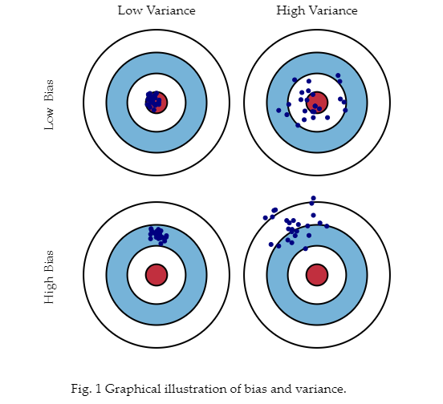

### 前言 

模型的预测误差可以被分解为两个子模块：偏差（bias）和方差（variance）。理解这两种误差可以帮助我们分析模型预测的误差，避免模型的过拟合或者欠拟合。

### 1.偏差和方差

下面分别从三个角度来定义偏差和方差：概念上、图形上、数学上。

#### 1.1 概念定义

- 偏差：模型预测的期望值（或者平均值）与我们要预测的真值之间的差。

> 解释：假设我们可以重复多次实验，每次都采集新的数据，并通过分析这些数据产生新的模型。由于数据的随机性，所以会产生一系列的预测结果。偏差就是衡量了这些结果和真值的距离。其实可以理解为我们无法获取某个任务的所有数据，我们的数据集只是整个数据的一个采样子集。类比于高斯分布的均值，通过采样数据求得的均值和整个分布的均值一定存在偏差，根据大数定理，采样的数据集越大，结果就越接近真值。

- 方差：方差就是指模型对一个指定点预测的不定性（variability）。
> 解释：同理，方差就是重复试验得到的一系列的预测结果对于指定点的离散程度。这个指定点指的是这些预测结果的期望值（均值），而不是真值。

#### 1.2 图像定义

> 解释：靶心就是真值，偏差反映的是预测值与真值的距离；方差反应的预测值的离散程度。

#### 1.3 数学定义

[偏差（Bias）与方差（Variance） - 知乎 (zhihu.com)](https://zhuanlan.zhihu.com/p/38853908)

[Understanding the Bias-Variance Tradeoff (fortmann-roe.com)](https://scott.fortmann-roe.com/docs/BiasVariance.html)

