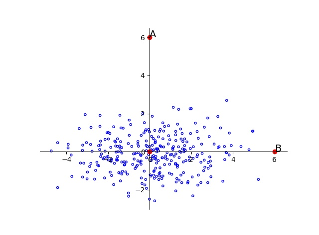

#### 归一化和标准化的异同以及选择

归一化（normalization）：
$$
\frac{X_i-X_{min}}{X_{max}-X_{min}}
$$
标准化（standardization）：
$$
\frac{X_i-\mu}{\sigma}
$$
**相同点：**

- 归一化和标准化本质上都是线性变换（按比例压缩再平移），线性变换的特性（比如不改变数值的排序）保证了数据通过变换后不会“失效”。

- **归一化和标准化都会改变原始数据的分布**。模型学习的是归一化或标准化后的数据分布，所以所有数据都要统一处理。

**不同点：**

- 缩放尺度不一样。输出范围不一样。
- 归一化是将数据“拍扁”，缩放到统一的区间。输出范围在[0,1]。缩放尺度取决于数据的最大最小值，易受异常值干扰；
- 标准化的缩放更加“动态”，如果原始数据较为集中，则标准化后更加分散，反之亦然。输出范围在负无穷到正无穷。缩放尺度取决于每个数据点，和数据的整体分布有很大关系。

**如何选择？**

- 如果对于输出范围有要求，则选归一化。
- 如果数据较为稳定，不存在极端的最大最小值，则选归一化。
- 如果数据存在异常值和较多噪音，用标准化。
- 推荐优先使用标准化。

----

#### 为什么要标准化？

- 加快收敛速度
- 归一化，统一量纲；标准化减去均值，使数据分布零对称；除以方差，消除数据分布对分类的影响。

这里解释一下除以方差的必要性：

以如下二维数据为例，如果不除以维度的方差，则点A和点B到样本分布中心的距离是一致的，但明显，点B更接近样本分布。

[特征工程中的「归一化」有什么作用？ - 知乎 (zhihu.com)](https://www.zhihu.com/question/20455227/answer/197897298)

[马氏距离(Mahalanobis Distance) - 知乎 (zhihu.com)](https://zhuanlan.zhihu.com/p/46626607)

----

#### 什么时候不需要做标准化？

- 如果数据变换前后，**最优解等价**，则不需要，但数据标准化有助于模型收敛。如无正则项的线性回归、逻辑回归、树模型。

- 如果数据变换前后，**最优解与原来不等价**，则必须进行标准化，以免模型被数据分布范围较大或较小的数据支配。如SVM、带正则项的线性回归、KNN、K-means。

- [ ] 主要看模型是否有伸缩不变性。而模型是否有伸缩不变性，通常取决于loss。如果loss有用到欧氏距离，则数据变换会影响到loss？待定

[在进行数据分析的时候，什么情况下需要对数据进行标准化处理？ - 知乎 (zhihu.com)](https://www.zhihu.com/question/30038463/answer/50491149)

----

#### 如何做归一化&标准化？

使用训练集的归一化&标准化参数来对测试集数据进行归一化&标准化。

----

#### 参考

[特征工程中的「归一化」有什么作用？ - 知乎 (zhihu.com)](https://www.zhihu.com/question/20455227)

https://www.zhihu.com/question/31186681/answer/50929278

