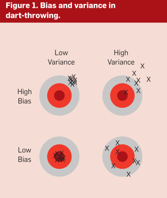

主要是一些公认的民间的常识。

关键见解（key insights）：

- 机器学习可以通过分析具体案例，得出如何执行重要的任务，也就是说经验是可行的。
- 机器学习广泛应用于计算机学科和其他学科，但是机器学习很多玄学，是难以在教科书中学到的。
- 本文总结了机器学习从业者学习的12个关键课程，包括如何避免陷阱，如何关注问题重点，以及常见问题的答案。

本文重点关注最成熟的任务：分类。

#### 1. 学习=表征+评估+优化

==绝大多数教材都是按照模型来组织的，往往会忽略其他两个组件的重要性。==

#### 2. 泛化能力才是重要的（It’s Generalization that counts）

1. 数据要分为训练数据和测试数据，只提高训练数据的预测精度是不够，这样可能会造成过拟合。100%的在训练数据上的精度，可能在测试数据上只有50%. 在训练数据上75%的精度可能测试数据上也是75%的精度，由于前面的分类器。所以说泛化能力才是最重要的。

#### 3. 只有数据是不够的

1. 只有数据是无法进行机器学习的，必须有先验的知识在算法里面。（no free lunch理论)
2. 先验知识比如，用什么建模，评估，如何优化

#### 4. 过拟合有很多方面 （overfitting has many faces)

1. 误差可以分解为 bias和variance两个方面，如下图

   1.1 bias可以理解是预测或估计很多次的均值

   1.2 variance表示很多次估计的方差，如右下角的图，虽然均值和真实接近，但是每一次估计的方差过大。

   ==1.3 线性模型一般variance小，bias大==

   ==1.4 树模型一般variance大，bias小==

2. 下面几个思路可能减小过拟合：
      2.1 交叉验证 （cross validation), 即每次抽出一部分数据作为test data, 剩下的作为training data。
      2.2 可以加入正则项，避免模型过于复杂。

3. 一个常见的误解是，有噪声的情况才会出现过拟合。（没有噪声也会出现过拟合）

#### 5. ==直觉在高维度行不通==

1. 维数灾难
2. 在高维度的相似度和低纬度的相似度不同
3. ==直觉上，加入一些信息量少的feature可能不会影响预测效果，因为它最多少提供一些信息。然后现实中，这些feature提供的信息的益处不如它增加的维度对结果所带来的坏处==。
4. 可以通过一定方法降维输入的feature，如PCA等
> 但这个部分其实也没说到具体的例子和处理方法，只是说了高纬度情况下，可以采用降维的方法。这一部分可以展开，具体也可以看维度诅咒笔记。[^ 1]

#### 6. 理论保证不一定可靠

1. 现实实现中，理论保证不一定可靠
2. 理论推动了机器学习的发展，但是在实际中只是参考因素之一

#### 7. 特征工程（选择）是关键 (feature engineering is the key)

1. 为什么有些机器学习项目成功了，有些没有呢？最核心的原因就是feature的选择使用。
2. 实际项目中，很多时间都在用于，收集、清理、预处理数据，特征选择。然后才是放在算法中跑
3. 跑算法可能是其中最快的一环。（因为很成熟了）
4. 在特征选择时，需要加入人的知识在里面，那些效果好的算法往往是特征选择的好。（以呼应了前面的理论，只有data是不够的，需要人的智慧）
> 难怪现在数据挖掘工程师都被称为feature engineer

#### 8. 更多的数据可以打败更聪明的算法

1. 假设你已经拿到了最优的feature,如何继续优化
	1.1 设计更好的算法
	1.2 使用更多的数据
2. 很多研究者专注于设计更好的算法，而最快速简单的方法就是收集使用更多的数据
3. 80年代收集数据是问题，现在主要的问题是处理数据的速度。

#### 9. 学习更多的模型，而不是一个

1. 现在 model ensembles的技术非常标准了，最简单的就是bagging.
2. 简单来说就是多训练不同的模型，用model ensembles的技术将这些模型综合起来用，可以得到比任何模型单一都好的效果。（在netflixprize比赛中也得到了体现，不同队伍的分类器组合到一起可以得到一个更优的分类器）

#### 10. 简单并不代表准确

- 如果假设模型比较的简单，并且获取了比较好的结果，说明是假设的比较精确。并不能说明越简单就越精确
- 简单本身就是一种优点，但是它和精确没有必然联系
#### 11. 可以被表征不一定代表可以被学习
#### 12. 相关关系并不意味着因果关系

#### 注脚

[^ 1]:[维度诅咒](../维度诅咒/维度诅咒.md)

