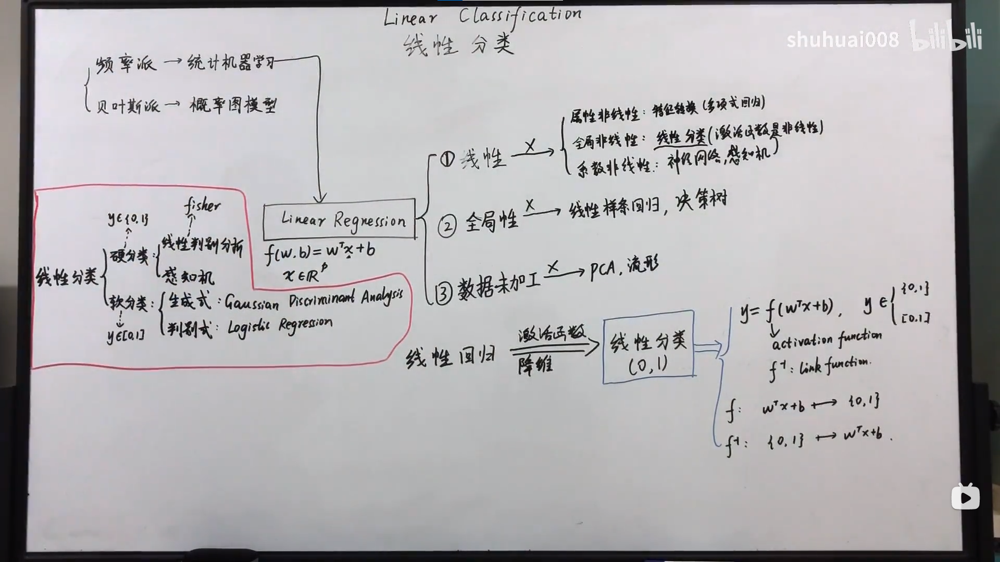

### 从线性回归衍生出的机器学习框架

**线性回归有三大特性**：

- 线性
- 全局性
- 数据未加工

**打破这些特性，就可以衍生出不同的算法**：

- 非线性：属性非线性（特征转换）、全局非线性（线性分类）、系数非线性（感知机、神经网络）
- 非全局性：线性样条回归、决策树
- 数据加工：PCA、流形

线性回归加入激活函数，转化为线性分类，也可以理解为降维，结果从多维降维一维。

**线性分类可以分为硬分类和软分类**

硬分类：y ∈ {0,1}，代表为线性判别分析、感知机

软分类：y ∈[0,1]，代表为高斯判别模型（生成模型）、逻辑回归（判别模型）

