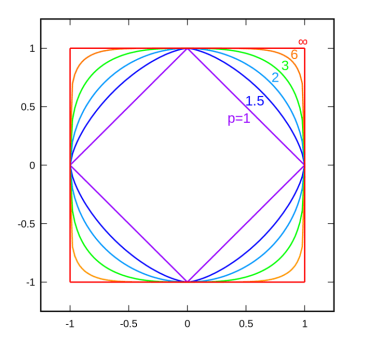
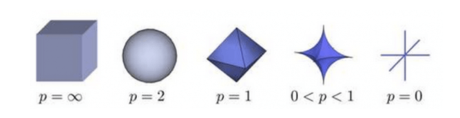

from [正则化详细总结 | 卢明冬的博客 (lumingdong.cn)](https://lumingdong.cn/detailed-summary-of-regularization.html)

#  正则化详细总结

[TOC]

## 1. 概述

正则化是机器学习中非常重要的一个技术点，因为它能够简单有效的减少泛化误差，在机器学习的应用实践中出现频率很高，尤其在深度学习模型中，由于其模型参数非常多很容易产生过拟合，使用正则化技术是行之有效的方法，因此正则化技术的研究成为了机器学习中热门的研究主题。

在早期的机器学习领域一般只是将范数惩罚叫做正则化技术，而**在深度学习领域对正则化技术做了推广，凡是被明确设计为以适度增大训练误差为代价来减少测试误差，适度增加偏差以减少方差的策略都可以认为是正则化技术**。故除了对参数添加范数惩罚，推广后的正则化技术还包括：扩增样本集、早停止、Dropout、集成学习、多任务学习、对抗训练、参数共享等。

本文仅讲解 “狭义” 的正则化技术，即对参数添加范数约束的正则化技术，不过依然会涉及其基本思想。

简单去理解正则化技术，就是在损失函数后面加一个对模型参数的约束函数，以防止模型过分拟合训练数据，这个函数可以称之为正则化函数，也就是正则化项，如下:

$$
w*=\arg\min\limits_{w} \sum_i{L(y_i, f(x_i;w))+\lambda\Omega(w)}
$$

其中 $\Omega(w)$ 就是正则化函数，正则化函数也有很多种选择，一般是模型复杂度的单调递增函数，模型越复杂，正则化值就越大。比如正则化项可以是模型参数向量的范数。然而，不同的选择对参数 w 的约束不同，取得的效果也不同，常见的有：零范数、一范数、二范数、迹范数、Frobenius 范数和核范数等等，下面先从正则化源头范数说起。

## 2. 绝对值，模，范数

说到正则化，就自然离不开范数，范数与我们熟悉的绝对值、模、距离都是有关联的，先了解下它们的定义。

**绝对值 (absolute value)**：是指一个数在数轴上所对应点 $x$ 到原点的距离，用 “|x|” 来表示。

**模 (module)**：向量 $\overrightarrow{x}$ 的长度叫做向量的模，记做或|$\overrightarrow{x}$|

**范数 (norm)**： 设 V 是数域 F 上的线性空间，且对于 V 的任一个向量 $x$，对应一个实数 $||x||$，满足以下条件：

1）正定性：$||x|| >= 0$，当且仅当 $x=0$ 时 $||x||=0$；
2）齐次性：$||cx|| = |c| ·||x|| $，$a \in F$; 
3）三角不等式：对任意 $x，y \in V$，都有 $||x+y|| <= ||x|| + ||y||$。

则称 $||x||$ 为向量 $x$ 的范数，$[V; ||·||]$ 为赋范空间。

在泛函分析中，范数定义在赋范线性空间中，它常常被用来度量某个向量空间（或矩阵）中的每个向量的长度或大小。通常记做 $||x||$。

<mark>**绝对值、模、范数之间的关系：**</mark>

实际上，**模是绝对值在二维和三维空间的推广，可以认为就是向量的长度。推广到高维空间中称为范数。**

## 3. 各种范数介绍

### 3.1. LP范数

**公式：**
$$
Lp=\sqrt[p]{\sum\limits_{1}^n x_i^p}，x=(x_1,x_2,\cdots,x_n)
$$
**描述：**

$||x||$ 为 $x$ 向量各个元素绝对值 $p$ 次方和的 $\frac{1}{p}$ 次方  

$LP$ 范数不是一个范数，而是一组范数，LP 范数是范数的一般化定义：

当 $p=0$ 时，就时 $L0$ 范数（非严格），即 $||x||_0$，也称零范数；

当 $p=1$ 时，就是 $L1$ 范数，即 $||x||_1$，也称一范数；

当 $p=2$ 时，就是 $L2$ 范数，即 $||x||_2$，也称二范数；

当 $p=∞$时，就是$ L∞$范数，即 $||x||_\infty $，也称无穷范数。

**距离：**

闵可夫斯基距离 (Minkowski Distance)

同范数一样，闵氏距离不是一种距离，而是一组距离的定义。

两个 n 维变量（或者两个 n 维空间点）$x_1(x_{11},x_{12},…,x_{1n})$ 与 $x_2(x_{21},x_{22},…,x_{2n})$ 间的闵可夫斯基距离定义为:

$$
 d_{ 12 }=\sqrt [ p ]{\sum_{k=1}^n|x_{1k}-x_{2k}|^p} 
$$

其中 $p$ 是一个变参数,

当 $p=1$ 时，就是曼哈顿距离，

当 $p=2$ 时，就是欧氏距离，

当 $p→∞$ 时，就是切比雪夫距离，       

根据变参数 p 的不同，闵氏距离可以表示一类的距离，同样的，根据 p 的不同，LP 范数可以表示某一范数。p 的不同取值，其对应范数和距离是一致的。

**可视化：**

根据 P 的变化，范数也有着不同的变化，有关 P 范数的变化图如下：

二维 LP-Ball：

三维 LP-Ball：

上图表示了 p 从无穷到 0 变化时，三维空间中到原点的距离（范数）为 1 的点构成的图形的变化情况。以常见的 L2 范数（p=2）为例，此时的范数也即欧氏距离，空间中到原点的欧氏距离为 1 的点构成了一个球面，采用不同的范数作为正则项，会得到完全不同的算法模型结果，故而对于不同要求的模型，应该采用不同的范数作为正则项。。

实际上，在 $0\le p\lt 1$ 时，LP 并不满足三角不等式的性质，也就不是严格意义下的范数。以 p=0.5，二维坐标 (1,4)、(4,1)、(1,9) 为例，$\sqrt[0.5]{(1+\sqrt{4})}+\sqrt[0.5]{(\sqrt{4}+1)}<\sqrt[0.5]{(1+\sqrt{9})}$。因此这里的 LP 范数只是一个概念上的宽泛说法。

### _3.2._L0范数

**公式：**

$$
||x||=\sqrt[0]{\sum\limits_1^nx_i^0}，x=(x_1,x_2,\cdots,x_n)
$$
**描述：**

向量中所有非零元素的个数。 

L0 严格来说已经不属于范数，上式中 0 次方和 0 次方根严格意义上是受限条件下才成立的。因此在实际应用中，多数人给出下面的替代定义：

$$
||x||_0=\#(i|x_i\neq 0)
$$
**特性：**

L0 范数表示向量中所有非零元素的个数。正是 L0 范数的这个属性，使得其非常适合机器学习中稀疏编码，特征选择的应用。通过最小化 L0 范数，来寻找最少最优的稀疏特征项。但不幸的是，L0 范数的最小化问题在实际应用中是 NP 难问题（很难优化求解）。因此很多情况下，L0 优化问题就会被放宽到更高维度的范数问题，如最常用的是 L1 范数，因为 L1 范数是 L0 范数的最优凸近似，而且它比 L0 范数要容易优化求解。 

### 3.3. L1范数

**公式：**

$$
||x||_1=\sum_i|x_i|
$$
**描述：**

向量中各个元素绝对值之和 。

L1 范数有很多的名字，例如我们熟悉的曼哈顿距离、最小绝对误差等。使用 L1 范数可以度量两个向量间的差异，如绝对误差和（Sum of Absolute Difference）： 

$$
SAD(x_1,x_2)=\sum_i|x_{1i}-x_{2i}|
$$
**距离：**

曼哈顿距离（Manhattan Distance）

曼哈顿距离是在欧几里得空间的固定直角坐标系上两点所形成的线段对轴产生的投影的距离总和。有时也被称为街区距离，例如在平面上，坐标（x1, y1）的点 P1 与坐标（x2, y2）的点 P2 的曼哈顿距离为：$|x_1-x_2|+|y_1-y_2|$，要注意的是，曼哈顿距离依赖座标系统的转度，而非系统在座标轴上的平移或映射。

**特性：**

L1 范数同 L0 范数一样，是可以实现稀疏的，因此 L1 范数也被叫做稀疏规则算子，而且 L1 因具有比 L0 更好的优化求解特性而被广泛应用，在计算机视觉中的绝对误差和 (Sum of Absolute Differences），平均绝对误差（Mean Absolute Error），都是利用 L1 范式的定义。L1 也可以通过实现特征的稀疏，去掉一些没有信息的特征，例如在对用户的电影爱好做分类的时候，用户有 100 个特征，可能只有十几个特征是对分类有用的，大部分特征如身高体重等可能都是无用的，利用 L1 范数就可以过滤掉。实际上，由于 L1 范数并没有平滑的函数表示，起初 L1 最优化问题解决起来非常困难，但随着计算机技术的到来，利用很多凸优化算法使得 L1 最优化成为可能。 

### 3.4. L2范数

**公式：** 

$$
||x||_2=\sqrt{\sum_ix_i^2}
$$
**描述：**

向量元素的平方和再开平方。 

L2 范数也称为 Euclid 范数 、E-范数，欧式范数、欧几里得范数，如果是拓展到矩阵范数，则是弗罗贝尼乌斯范数（Frobenius norm），即上面提到的 Frobenius 范数，也称为 F 范数。

像 L1 范数一样，L2 也可以度量两个向量间的差异，如平方差和（Sum of Squared Differences）: 

$$
SSD(x_1,x_2)=\sum_i(x_{1i}-x_{2i})^2
$$
**距离：**

欧式距离（Euclidean Distance）

欧式距离是最常见的两点之间或多点之间的距离表示法，又称之为欧几里得度量，它定义于欧几里得空间中。

n 维空间中两个点 $x_1(x_{11},x_{12},…,x_{1n})$ 与 $x_2(x_{21},x_{22},…,x_{2n})$ 间的欧氏距离：

$$
d_{ 12 }=\sqrt { \sum _{ k=1 }^{ n } (x_{ 1k }-x_{ 2k })^{ 2 } }
$$
也可以用表示成向量运算的形式：

$$
d_{ 12 }=\sqrt { (a-b)(a-b)^T }
$$
**特性：**

L2 范数的正则化项，可以有效防止模型为了迎合训练集而过于复杂造成过拟合的情况，从而提高模型的泛化能力。此外，L2 范数相比于 L0 范数、L1 范数是最方便求解的，借助于拉格朗日乘子法，可以非常简单的解决 L2 范数的最优化问题。

### 3.5. L$\infty$ 范数

**公式：** 
$$
||x||_\infty=\sqrt[\infty]{\sum\limits_1^nx_i^\infty}，x=(x_1,x_2,\cdots,x_n)
$$
**描述：**

向量中各个元素绝对值最大那个元素的绝对值

与 L0 一样，在通常情况下，大家都用的是： 

$$
||x||_\infty=max(|x_i|)
$$
既然有正无穷范数，就有负无穷范数，容易得出，负无穷范数就是想两种各个元素绝对值最小元素的绝对值，公式如下：

$$
||x||_{-\infty}=min(|x_i|)
$$

**距离：**

切比雪夫距离（Chebyshev distance）

有时被称为棋盘距离，各坐标数值差的最大值，在 2 维空间中的计算公式为： 

$$
d=\max(|x_1-x_2|,|y_1-y_2|)
$$

### 3.6.矢量范数小结

| 项目           | L0                 | L1            | L2                           | L$\infty$    |
| -------------- | ------------------ | ------------- | ---------------------------- | ------------ |
| **公式**       | $\# (i|x_i\neq 0)$ | $\sum_i|x_i|$ | $(\sum_ix_i^2)^\frac{1}{2} $ | $max(|x_i|)$ |
| **距离**       | ——                 | 曼哈顿距离    | 欧氏距离                     | 切比雪夫距离 |
| **二维范数球** |                    |               |                              |              |

<table style="width: 94.1453%; height: 302px;"><thead><tr class="firstRow" style="height: 24px;"><th style="word-break: break-all; width: 252px; height: 24px; text-align: left;" valign="top" width="252">项目</th><th style="word-break: break-all; height: 24px; width: 252px; text-align: left;" valign="top" width="252">L0</th><th style="word-break: break-all; height: 24px; width: 231px; text-align: left;" valign="top" width="231">L1</th><th style="word-break: break-all; height: 24px; width: 273px; text-align: left;" valign="top" width="273">L2</th><th style="word-break: break-all; height: 24px; width: 252px; text-align: left;" valign="top" width="252">L$\infty$</th></tr></thead><tbody><tr style="height: 24px;"><td style="word-break: break-all; height: 24px;" valign="top" width="252">**公式**</td><td style="word-break: break-all; height: 24px;" valign="top" width="252">$\#(i|x_i\neq 0)$ </td><td style="word-break: break-all; height: 24px;" valign="top" width="231">$\sum_i|x_i|$</td><td style="word-break: break-all; height: 24px;" valign="top" width="273">$(\sum_ix_i^2)^\frac{1}{2} $</td><td style="word-break: break-all; height: 24px;" valign="top" width="252">$max(|x_i|)$</td></tr><tr style="height: 24px;"><td style="word-break: break-all; height: 24px;" valign="top" width="252">**距离**</td><td style="word-break: break-all; height: 24px;" valign="top" width="252">——</td><td style="word-break: break-all; height: 24px;" valign="top" width="231">曼哈顿距离</td><td style="word-break: break-all; height: 24px;" valign="top" width="273">欧氏距离</td><td style="word-break: break-all; height: 24px;" valign="top" width="252">切比雪夫距离</td></tr><tr style="height: 182px;"><td style="word-break: break-all; height: 182px;" valign="top" width="252">**二维范数球**</td><td style="word-break: break-all; height: 182px;" valign="top" width="252">
[<noscript></noscript>](https://lumingdong.cn/wp-content/uploads/2018/11/regular-1.png)
</td><td style="height: 182px;" valign="top" width="231">

[<noscript></noscript>](https://lumingdong.cn/wp-content/uploads/2018/11/regular-2.png)
</td><td style="height: 182px;" valign="top" width="273">

[<noscript></noscript>](https://lumingdong.cn/wp-content/uploads/2018/11/regular-3.png)
</td><td style="height: 182px;" valign="top" width="252">[<noscript></noscript>](https://lumingdong.cn/wp-content/uploads/2018/11/regular-4.png)</td></tr><tr style="height: 48px;"><td style="word-break: break-all; height: 48px;" valign="top" width="252">**关键特性**</td><td style="height: 48px;" valign="top" width="252">稀疏解，NP 难问题</td><td style="height: 48px;" valign="top" width="231">稀疏解，L0 的最优凸近似，易优化，自动特征选择，可解释性好</td><td style="word-break: break-all; height: 48px;" valign="top" width="273">防过拟合，相对稳定，易求解</td><td style="word-break: break-all; height: 48px;" valign="top" width="252">——</td></tr></tbody></table>

上面提到的范数都是指矢量范数，下面我们简单了解一下矩阵范数。
> **@ 矩阵范数（了解）**

1-范数：$||A_1||=\max\limits_{j}\sum_{i=1}^m|a_{ij}|$， 列和范数，即所有矩阵列向量绝对值之和的最大值，MATLAB 调用函数 norm(A, 1)；

2-范数：$||A_1||=\sqrt{\lambda_1}$，$\lambda_1$ 为 $A^TA$ 的最大特征值，谱范数，即 A'A 矩阵的最大特征值的开平方，MATLAB 调用函数 norm(A, 2)；

$\infty$-范数：$||A||_\infty=\max\limits_{i}\sum_{j=1}^n|a_{ij}|$，行和范数，即所有矩阵行向量绝对值之和的最大值，MATLAB 调用函数 norm(A, 'inf')；

F-范数：$||A||_F=(\sum_{i=1}^m\sum_{j=1}^n|a_{ij}|^2)^\frac{1}{2}$，Frobenius 范数，即矩阵元素绝对值的平方和再开平方，MATLAB 调用函数 norm(A,  'fro')。

## _4._L1范数和L2范数的区别

L1 范数和 L2 范数是正则化使用最多的两种范数，接下来我们从不同的角度对比一下 L1 范数和 L2 范数，其实也是 L1 正则化和 L2 正则化的对比。

### _4.1._最优解

L1 的最优解是稀疏的，L1 会趋向于产生少量的特征，这些特征的值相对较大，而其他的特征都是 0 或者几乎为 0 值。L2 则会选择更多的特征，例如当遇到两个对预测有帮助的特征时，L1 倾向于选择一个更大的特征。而 L2 更倾向把两者结合起来。与 L1 范数相比，L2 的特征值几乎很少有非常明显的大值，都是一些相对较小的值，甚至接近于 0，但不会像 L1 范数等于 0，因为大值会导致 L2 范数比 L1 范数受到更大的惩罚，数值越大惩罚越重，削弱地越厉害，因为 L2 要保证所有的值都是较小的。但是，L2 范数最优化解出这些小的参数，并非没有好处，因为越小的参数意味着模型越简单，越简单的模型就越不容易产生过拟合现象。而且从参数的分布来看，几乎很少出现突兀的大的峰谷值，它们更多地会呈现缓和平稳的状态，如果没有离群值，那么这种小而平稳的参数分布会使得模型拟合的更好，所以**一般情况下，L2 范数往往比 L1 范数表现的更好**。[1]

从最优化问题解的平滑性来看，L1 范数的最优解相对于 L2 范数要少，但其往往是最优解，而 L2 的解很多，但更多的倾向于某种局部最优解 [2]。
> **@ 特征选择与稀疏编码**

机器学习社区里通常把特征选择的方法分为三种。一种是基于统计学的一些方法，对特征进行预筛选，选出子集作为模型输入。如统计推理使用的假设检验，P 值。另一种是采用某种成熟的学习算法进行特征选择，如决策树中采用信息增益来选择特征。还有一种便是在模型算法中进行自动特征选择。而 L1 范数作为正则化项，其特征选择的图谱倾向于 spiky，实现了有效的特征选择。

稀疏编码也是想通过寻找尽可能少的特征表达某个输入的向量 X。

$$ \min \; a_{i}^{\left( j \right)},\phi _{i}\; \; \sum_{j=1}^{m}{\left| \left| x^{\left( j \right)}-\sum_{i=1}^{k}{a_{i}^{\left( j \right)}\phi _{i}} \right| \right|^{2}\; +\; \lambda \sum_{i=1}^{k}{\mbox{S}\left( a_{i}^{\left( j \right)} \right)}}$$

其中 $\phi _{i}$ 是所要寻找的基向量，$a_{i}^{\left( j \right)}$ 是我们要优化的各个基向量的权重。最右边的表达式便是其正则化惩罚项，在这里也称 Sparse Cost。实际中我们通常便用 L1 范数。

### _4.2._解决不适定（病态）问题

L2 除了能够防止过拟合，还有一个好处就是能改善不适定问题（ill-posed problem)[3]。尤其是当训练样本相对于特征数非常少时，其矩阵便是非满秩的，往往倾向于有无数个解，且是不可逆的。其条件数便会很大。一方面，根据此得到的最优化值很不稳定，往往某个特征变量很小的变动都会引发最终结果较大的偏差。另外通过矩阵求逆从而求的最优解就会变的非常困难。这一点在 [《线性回归》](https://lumingdong.cn/linear-regression.html "《线性回归》")一文中已经有讲到，对于线性回归而言，求的最优解析解为： 

$$ \theta \; =\; \left( X^{T}X \right)^{-1}X^{T}y $$

而加上 L2 正则项后，其变为：

$$ \theta \; =\; \left( X^{T}X\; +\; \lambda I \right)^{-1}X^{T}y$$

从而可以直接求逆，改善了条件数，避免了求解不可逆的情况。**正则化解决了逆问题的不适定性，产生的解是存在且唯一的，同时也是依赖于数据的，因此噪声对不适定的影响就弱，解就不会过拟合。而且如果先验 (正则化) 合适，则解就倾向于符合真解 (更不会过拟合了)，即使训练集中彼此间不相关的样本数很少**[6]**。**
> **@ 不适定问题、条件数、病态问题**

**不适定问题 <strong>（ill-posed problem）[7]**：</strong>

适定性的概念是在 1923 年由数学家阿达玛（J.Hadamard）在研究数学物理的定解问题提出的，**适定问题（Well-posed problem）**是指满足下列三个要求的问题:

   1) 解是存在的（existence）;

   2) 解是惟一的（uniqueness）;

   3) 解是稳定的（stability），即连续依赖于初始数据。

这三个要求中，只要有一个不满足，则称之为**不适定问题**。特别，如果条件三不满足，那么就称为阿达玛意义下的不适定问题。一般地说不适定问题，常常是指阿达马意义下的不适定问题。

**条件数（condition number）[8]:**

条件数是线性方程组 Ax=b 的解对 b 中的误差或不确定度的敏感性的度量。数学定义为矩阵 A 的条件数等于 A 的范数与 A 的逆的范数的乘积。表示如下：

$$cond(A)=‖A‖·‖A^{-1}‖$$

从线性代数的分析可知，**矩阵的条件数总是大于 1，正交矩阵的条件数等于 1，奇异矩阵的条件数为无穷大，而病态矩阵的条件数则为比较大的数据**。

数值分析中，一个问题的条件数是该数量在数值计算中的容易程度的衡量，也就是该问题的适定性。一个低条件数的问题称为良置的，而高条件数的问题称为病态（或者说非良置）的。

**病态问题（ill-condition problem）[9]：**

病态问题是指输出结果对输入数据非常敏感的问题，如果输入数据有微小误差，则引起问题解的相对误差很大。 

提到病态问题就不得不谈到对反问题的研究，反问题的特点是其不适定性，所给数据可能不属于该数学问题或所建模型的值域，故此类问题的解可能不存在，即使此问题的解存在也可能不唯一，并且该问题的解不连续地因观测数据的变化而变化，从而就导致数值模拟的不稳定行。

通常不适定问题是由一组线性代数方程定义的，这组方程通常都有着较大的条件数。也就意味着其带有的误差将严重的影响问题的计算结果。我们知道反问题中最常见的是已知输出求输入。**通常不适定问题都具有病态性**，并且不论通过什么方法去改变问题本身都不能显著地改善其所具有的病态性。需要着重指出的是**病态问题却不一定是不适定的**，因为通过一些手段改变了问题的形式之后，就可以解决这个病态问题。在严格的数学意义上，我们通常不可能对不适定问题进行求解并得到准确的答案。然而，**通过使用我们所知道的先验知识（正则化），我们通常有希望能得到一个接近准确的答案。**

### _4.3._计算效率

从迭代优化（如梯度下降法）的角度来讲，**条件数太大会拖慢迭代的收敛速度**，L2 正则化通过将目标函数变为λ强凸（λ-strongly convex），有效的加快了其收敛速度 [3]。 而 L1 尽管也是凸的，但不像 L2 那样 “处处是平滑的”，换句话说，L1 不是处处可导的，这就阻碍了梯度下降法的使用，因此 **L1 只能借助更高级的优化算法才能求解**，如**近端梯度法（Proximal Gradient Method , PG）**或类似**交替方向乘子法 (Alternating Direction Method of Multipliers, ADMM)**这样的原始-对偶法 [10]。

因此从计算效率（Computational efficiency）来讲，L2 有解析解，也可利用梯度下降法迭代优化，因此计算效率很高，而 L1 没有解析解（analytical solution），且迭代优化比 L2 要麻烦一些，如果不考虑稀疏的情况，L1 的计算效率是比较低的。但是，L1 的解有稀疏的属性，它可以和稀疏算法一起用，这可以使计算更加高效，这样的情况计算效率还是要依据具体的问题来判断 [11]。

### _4.4._先验假设

从统计概率的角度来看，L1 范数和 L2 范数其实对向量中值的分布有着不同的先验假设：

L1 正则化等价于对参数引入拉普拉斯先验，L2 正则化等价于对参数引入高斯先验。

[<noscript></noscript>](https://lumingdong.cn/wp-content/uploads/2018/11/regular-1.jpg)

上图中，L1 是蓝色的线，L2 是红色的线，很明显，L1 的分布对极端值更能容忍。 也就是相对来说说 L2 对离群值（outlier）更敏感 [5]。 

### _4.5._零附近下降速度

我们知道，L1 和 L2 都是正则化的方式，我们将权值参数以 L1 或者 L2 的方式放到代价函数里面去。然后模型就会尝试去最小化这些权值参数。而这个最小化就像一个下坡的过程，L1 和 L2 的差别就在于这个 “坡” 不同，如下图：L1 就是按绝对值函数的 “坡” 下降的，而 L2 是按二次函数的 “坡” 下降。所以实际上在 0 附近，L1 的下降速度比 L2 的下降速度要快，会非常快得降到 0[3]。

[<noscript></noscript>](https://lumingdong.cn/wp-content/uploads/2018/11/regular-6.png)

### _4.6._空间限制

根据我们上面对正则化的讲解，我们基本了解了其实正则化就是对参数添加约束，**正则化其实和 “带约束条件的目标函数” 是等价的**，只需经过拉格朗日乘子法即可转换到熟悉的正则化公式，如：

$$J(w)=\sum_{i=1}^N(y_i -w^Tx_i)^2, \;\; s.t. ||w||_2^2\le C$$

利用拉格朗日乘子法可转化为：

$$J(w)=\sum_{i=1}^N(y_i -w^Tx_i)^2+\lambda(||w||_2^2-C)$$

同样，对于 L1 和 L2 规则化的代价函数来说，我们可以写成以下形式：

$$ Lasso: \;\;\; \underset{W}{\min} \frac{1}{n}||Y-XW||^2, \;\; s.t.||W||_1\le C$$

$$ Ridge: \;\;\; \underset{W}{\min} \frac{1}{n}||Y-XW||^2, \;\; s.t.||W||_2\le C$$

也就是说，我们将模型空间限制在 w 的一个 L1-ball 中。为了便于可视化，我们考虑两维的情况，在 (w1, w2) 平面上可以画出目标函数的等高线，而约束条件则成为平面上半径为 C 的一个 norm ball 。等高线与 norm ball 首次相交的地方就是最优解：

[<noscript></noscript>](https://lumingdong.cn/wp-content/uploads/2018/11/regular-7.png)

可以看到，L1-ball 与 L2-ball 的不同就在于 L1 在和每个坐标轴相交的地方都有 “角” 出现，而目标函数的测地线除非位置摆得非常好，大部分时候都会在角的地方相交。注意到在角的位置就会产生稀疏性，例如图中的相交点就有 w1=0，而更高维的时候（想象一下三维的 L1-ball 是什么样的？）除了角点以外，还有很多边的轮廓也是会有很大的概率成为第一次相交的地方，又会产生稀疏性。

相比之下，L2-ball 就没有这样的性质，因为没有角，所以第一次相交的地方出现在具有稀疏性的位置的概率就变得非常小了。这就从直观上来解释了为什么 L1 正则化能产生稀疏性，而 L2 正则化不行的原因了 [3]。

### _4.7._L1与L2的区别小结
<table><thead><tr class="firstRow"><th style="word-break: break-all; width: 286px;" valign="top" width="286">**项目**</th><th style="word-break: break-all; width: 286px;" valign="top" width="286">**L1（Lasso）**</th><th style="word-break: break-all; width: 286px;" valign="top" width="286">**L2（Ridge）**</th></tr></thead><tbody><tr><td style="word-break: break-all;" valign="top" width="286">**防过拟合（泛化能力）**</td><td style="word-break: break-all;" valign="top" width="286">有💡</td><td style="word-break: break-all;" valign="top" width="286">有💡</td></tr><tr><td style="word-break: break-all;" valign="top" width="286">**稀疏编码**</td><td style="word-break: break-all;" valign="top" width="286">有💡</td><td style="word-break: break-all;" valign="top" width="286">没有</td></tr><tr><td style="word-break: break-all;" valign="top" width="286">**特征选择**</td><td style="word-break: break-all;" valign="top" width="286">有💡</td><td style="word-break: break-all;" valign="top" width="286">没有</td></tr><tr><td style="word-break: break-all;" valign="top" width="286">**解析解**</td><td style="word-break: break-all;" valign="top" width="286">没有</td><td style="word-break: break-all;" valign="top" width="286">有💡</td></tr><tr><td style="word-break: break-all;" valign="top" width="286">**解决不适定（病态）问题**</td><td style="word-break: break-all;" valign="top" width="286">没有</td><td style="word-break: break-all;" valign="top" width="286">有💡</td></tr><tr><td style="word-break: break-all;" valign="top" width="286">**解个数**</td><td style="word-break: break-all;" valign="top" width="286">少💡</td><td style="word-break: break-all;" valign="top" width="286">多</td></tr><tr><td style="word-break: break-all;" valign="top" width="286">**特征系数**</td><td style="word-break: break-all;" valign="top" width="286">大</td><td style="word-break: break-all;" valign="top" width="286">小💡</td></tr><tr><td style="word-break: break-all;" valign="top" width="286">**拟合性能**</td><td style="word-break: break-all;" valign="top" width="286">弱</td><td style="word-break: break-all;" valign="top" width="286">强💡</td></tr><tr><td style="word-break: break-all;" colspan="1" rowspan="1" valign="top">**离群值抗干扰能力**</td><td style="word-break: break-all;" colspan="1" rowspan="1" valign="top">强💡</td><td style="word-break: break-all;" colspan="1" rowspan="1" valign="top">弱</td></tr><tr><td style="word-break: break-all;" colspan="1" rowspan="1" valign="top">**计算效率**</td><td colspan="1" rowspan="1" valign="top">低（非稀疏情况）</td><td style="word-break: break-all;" colspan="1" rowspan="1" valign="top">高💡</td></tr><tr><td style="word-break: break-all;" colspan="1" rowspan="1" valign="top">**零附近下降速度**</td><td style="word-break: break-all;" colspan="1" rowspan="1" valign="top">快💡</td><td style="word-break: break-all;" colspan="1" rowspan="1" valign="top">慢</td></tr><tr><td style="word-break: break-all;" valign="top" width="286">**先验假设**</td><td style="word-break: break-all;" valign="top" width="286">参数服从拉普拉斯分布</td><td style="word-break: break-all;" valign="top" width="286">参数服从高斯分布</td></tr></tbody></table>

## _5._正则化的理解

在 [《线性回归》](https://lumingdong.cn/linear-regression.html "《线性回归》")一文中已经讲过一些常用正则化的知识，最常用的对参数约束的正则化方法有以下几种:
<table><thead><tr class="firstRow"><th style="word-break: break-all;" valign="top" width="92">英文名</th><th style="word-break: break-all;" valign="top" width="99">中文翻译</th><th style="word-break: break-all;" valign="top" width="78">范数</th><th style="word-break: break-all;" valign="top" width="125">约束方式</th><th style="word-break: break-all;" valign="top" width="200">优点</th></tr></thead><tbody><tr><td style="word-break: break-all;" valign="top" width="92">LASSO</td><td style="word-break: break-all;" valign="top" width="99">最小绝对衰减和选择子</td><td style="word-break: break-all;" valign="top" width="78">L1</td><td style="word-break: break-all;" valign="top" width="125">绝对值和</td><td style="word-break: break-all;" valign="top" width="200">特征选择</td></tr><tr><td style="word-break: break-all;" valign="top" width="92">Ridge</td><td style="word-break: break-all;" valign="top" width="99">岭回归</td><td style="word-break: break-all;" valign="top" width="78">L2</td><td style="word-break: break-all;" valign="top" width="125">平方和</td><td style="word-break: break-all;" valign="top" width="200">性能稍好，方便计算</td></tr><tr><td style="word-break: break-all;" valign="top" width="92">Elastic Net</td><td style="word-break: break-all;" valign="top" width="99">弹性网络</td><td style="word-break: break-all;" valign="top" width="78">L1、L2</td><td style="word-break: break-all;" valign="top" width="125">绝对值和、平方和</td><td style="word-break: break-all;" valign="top" width="200">结合 LASSO 和 Ridge 的优点</td></tr></tbody></table>

线性回归中的正则化示例：

**L1-regularization，Lasso：**

$$J(\theta )=\frac { 1 }{ 2 } \sum _{ i=1 }^{ m }{ (h_{ \theta  }(x^{ (i) })-y^{ (i) })^{ 2 } } +\lambda \sum _{ j=1 }^{ n }{ |\theta _{ j }|}$$

**L2-regularization，Ridge：**

$$J(\theta )=\frac { 1 }{ 2 } \sum _{ i=1 }^{ m }{ (h_{ \theta  }(x^{ (i) })-y^{ (i) })^{ 2 } } +\lambda \sum _{ j=1 }^{ n }{ \theta _{ j }^{ 2 } }$$

**Elastic Net，弹性网络：**

$$J(\theta )=\frac { 1 }{ 2 } \sum _{ i=1 }^{ m }{ (h_{ \theta  }(x^{ (i) })-y^{ (i) })^{ 2 } } +\lambda \left( \rho \cdot \sum _{ j=1 }^{ n }{ |\theta _{ j }|+(1-\rho ) } \cdot \sum _{ j=1 }^{ n }{ \theta_j^2} \right) $$

注：上式中，$\lambda$ 是调节因子，用来控制正则项的惩罚力度，要求 $\lambda &gt;0$。第三种方式弹性网络是上面两种方式的结合，通过权重因子 $\rho$ 来调节配置两种正则化方式的权重，要求 $\rho \in [0, 1]$。

[<noscript></noscript>](https://lumingdong.cn/wp-content/uploads/2018/11/regular-8.png)

下面我们将从不同的角度来深入理解正则化。

### _5.1._贝叶斯角度理解正则化

贝叶斯角度理解正则化，我们在上面《L1 范数和 L2 范数的区别》这一小节中已经简单提到过，其实就是从先验假设的角度理解，L1 正则的先验假设是参数服从拉普拉斯分布，L2 正则的先验假设是参数服从高斯分布，下面我们详细解读。

我们以线性回归为基础去研究，在 [《线性回归》](https://lumingdong.cn/linear-regression.html "《线性回归》")一文中我们通过最大似然估计推导出最小二乘法，得到：

$$ w_{MLE} = \arg \underset{w}{\min} \sum_{i=1}^{m} (y^{(i)} - w^Tx^{(i)})^2 $$

但这是在我们对参数 w 没有加入任何先验分布的情况下。在数据维度很高的情况下，我们的模型参数很多，模型复杂度高，容易发生过拟合。

比如我们常说的 “small n, large p problem”。我们一般用 n 表示数据点的个数，用 p 表示变量的个数 ，即数据维度。当 $p\gg n$ 的时候，不做任何其他假设或者限制的话，学习问题基本上是没法进行的。因为如果用上所有变量的话， p 越大，通常会导致模型越复杂，但是反过来 n 又很小，于是就会出现很严重的过拟合问题。

[<noscript></noscript>](https://lumingdong.cn/wp-content/uploads/2018/11/regular-9.png)

这个时候，我们可以对参数 w 引入先验分布，降低模型复杂度。

**Ridge（L2-regularization）**

我们对参数 w 引入协方差为 $\alpha$ 的零均值高斯先验。

[<noscript></noscript>](https://lumingdong.cn/wp-content/uploads/2018/11/regular-10.png)

由于引入了先验分布，我们用最大后验估计 (MAP)：

[<noscript></noscript>](https://lumingdong.cn/wp-content/uploads/2018/11/regular-15.png)

&nbsp;

取对数：

[<noscript></noscript>](https://lumingdong.cn/wp-content/uploads/2018/11/regular-16.png)

等价于：

$$J_R(w) = \frac{1}{n}|| y- w^TX ||_2 + \lambda ||w||_2$$

这不就是 **Ridge Regression** 吗？

另外，**由 $\lambda=\frac{1}{2\alpha}$ 可以看出，超参数 $\lambda$ 与协方差 $\alpha$ 是成反比的，即 $\lambda$ 越大，表示 w 的先验分布的协方差越小，也就是 w 越稳定。**

[<noscript></noscript>](https://lumingdong.cn/wp-content/uploads/2018/11/regular-11.png)

看我们得到的参数，在零附近是不是很密集，老实说 ridge regression 并不具有产生稀疏解的能力，也就是说参数并不会真出现很多零。假设我们的预测结果与两个特征相关，L2 正则倾向于综合两者的影响，给影响大的特征赋予高的权重；而 L1 正则倾向于选择影响较大的参数，而舍弃掉影响较小的那个。实际应用中 L2 正则表现往往会优于 L1 正则，但 L1 正则会大大降低我们的计算量 (特征更少)。

那现在我们知道了，**对参数引入高斯先验等价于 L2 正则化**。

**Lasso（L1-regularization）**

上面我们对 w 引入了高斯分布，那么拉普拉斯分布 (Laplace distribution) 呢？

注：LASSO - least absolute shrinkage and selection operator。

[<noscript></noscript>](https://lumingdong.cn/wp-content/uploads/2018/11/regular-12.png)

我们看下拉普拉斯分布长啥样：

$$ f(x\mid\mu,b) = \frac{1}{2b} \exp \left( -\frac{|x-\mu|}{b} \right) \,\!$$

[<noscript></noscript>](https://lumingdong.cn/wp-content/uploads/2018/11/regular-14.png)

关于拉普拉斯和正态分布的渊源，大家可以参见《[正态分布的前世今生](https://lumingdong.cn/go/8h2kje "正态分布的前世今生")》。

重复之前的推导过程我们很容易得到：

$$w_{MAP_{Laplace}} = \arg \underset{w}{\min} \left( \frac{1}{\delta^2}\cdot \frac{1}{2} \sum_{i=1}^{m} (y^{(i)} - w^Tx^{(i)})^2 + \frac{1}{b^2}\cdot \frac{1}{2} ||w||_1 \right) $$

该问题通常被称为 LASSO (least absolute shrinkage and selection operator) 。LASSO 仍然是一个 convex optimization 问题，不具有解析解。它的优良性质是能产生稀疏性，导致 w 中许多项变成零。

因此，**对参数引入拉普拉斯先验等价于 L1 正则化**。

**小结**

**正则化参数等价于对参数引入先验分布，使得模型复杂度变小（缩小解空间），对于噪声以及 outliers 的鲁棒性增强（泛化能力）。整个最优化问题从贝叶斯观点来看是一种贝叶斯最大后验估计，其中正则化项对应后验估计中的先验信息 ，损失函数对应后验估计中的似然函数，两者的乘积即对应贝叶斯最大后验估计的形式 [4]****。**

### _5.2._风险最小化理论理解正则化

我们先从几个相关概念讲起。

**期望风险（expected risk）：**

描述模型与训练样本以及测试样本（或者称之为 “未知样本”）的拟合程度。

表示如下： 

$$ R_{exp}(f)=E_p[L(Y, f(X))]=\int_{a\times b}L(y, f(x))P(x,y)dxdy$$

其中：

$L(Y, f(X))$ 表示损失函数，损失函数值越小，说明模型对样本（训练样本以及测试样本）的拟合程度越好；

$P(X,Y)$ 表示 X 与 Y 的联合概率分布。

**期望风险是模型 $f(x)$ 关于联合分布 $P(X,Y)$ 的平均意义下的损失（期望损失），有时候也称为风险函数（risk function）或期望损失（expected loss），记做 $R_{exp}(f)$**

**期望风险最小化（expected risk minimization）：**

机器学习的目标就是选择期望风险最小的模型，但由于我们只有部分训练样本，它不能够完全代表测试样本（未知样本）的分布，**所以联合分布 P(X, Y) 是未知的，$R_{exp}(f)$ 不能直接计算。**实际上，如果知道联合分布 $P(X,Y)$，可以从联合分布直接求出条件概率分布 $P(Y|X)$，也就不需要学习了。正因为不知道联合概率，所以才需要学习，这样一来，一方面根据期望风险最小化学习模型要用到联合分布，另一方面联合分布又是未知的，所以这样的监督学习就成为一个病态问题（ill-formed problem）。**通过计算期望风险最小化来选择模型这条路已经不通了**，我们是否还有其他的学习准则或最优模型的选择方法呢？继续往下看。

**经验风险（empirical risk）：**

描述模型与训练样本的拟合程度。

表示如下：  

$$ R_{emp}(f)=\frac{1}{N}\sum_{i=1}^NL(y_i,f(x_i)) $$

其中，

$L(Y,f(X))$ 表示损失函数；

$N$ 表示训练样本的个数。

**经验风险是模型关于训练样本的平均损失，记得做 $R_{emp}(f)$**

**经验风险最小化（empirical risk minimization，ERM）：**

期望风险 $R_{exp}(f)$ 是模型关于联合分布 $P(X,Y)$ 的期望损失，经验风险 $R_{emp}(f)$ 是模型关于训练样本的平均损失。**根据大数定理，当样本容量 N 趋于无穷时，经验风险 $R_{emp}(f)$ 趋于期望风险 $R_{exp}(f)$。**而且训练样本是已知的，经验风险是可计算的，所以自然而然地会想到用经验风险估计期望风险。

**当样本容量足够大时，经验风险最小化能保证有很好的学习效果，在现实实践中也会被采用，比如，极大似然估计（maximum likelihood estimation）就是经验风险最小化的一个例子。当模型是条件概率分布，损失函数是对数损失函数时，经验风险最小化就等价于极大似然估计。**

但是由于现实中的训练样本数目有限，甚至很小，如果不管不顾地使经验风险最小化，只会让模型通过提高模型复杂度来过度拟合训练样本，从而使模型的泛化能力变弱，导致过拟合。**所以我们要对经验风险进行一定的矫正，通过限制模型的复杂程度，从而使得我们的模型不仅能够很好地拟合训练样本，而且能够具备比较优秀的泛化能力**，以此达到趋近期望风险的效果，进行模型的选择。 

**结构风险（structural risk）：**

描述模型与训练样本的拟合程度，以及模型的复杂程度。

表示如下： 

$$ R_{srm}(f)=\frac{1}{N}\sum_{i=1}^NL(y_i,f(x_i))+\lambda\Omega(f) $$

其中，

$L(Y,f(X))$ 表示损失函数；

$N$ 表示训练样本的个数；

$\Omega(f)$ 称为正则项（或者惩罚项），表示模型的复杂程度；

$\lambda \ge0$ 是系数，用于权衡经验风险与模型复杂程度；

$\lambda$ 的取值，正是机器学习中，我们需要调节的超参数。 

**结构风险最小化（structural risk minimization， SRM）：**

本文的主角” 正则化 “终于登场了，从结构风险函数可以看到，**正则化正是结构风险函数的重要组成部分，正则化的加入，使得经验风险升级成为了结构风险。**

结构风险小需要经验风险与模型复杂度同时小，结构风险小的模型往往对训练数据以及未知的测试数据都有较好的预测。

**实际应用中，贝叶斯估计的最大后验概率估计（maximum posterior probability estimation，MAP）就是结构风险最小化的一个例子，当模型是条件概率分布、损失函数是对数损失函数、模型复杂度由模型的先验概率表示时，结构风险最小就等价于最大后验概率估计。**

**结构风险最小化的策略认为结构最小的模型是最优模型，所以求最优模型，就是求解最优化问题：**

$$\underset{f}{\min} \frac{1}{N}\sum_{i=1}^NL(y_i,f(x_i))+\lambda\Omega(f)$$

这样，监督学习问题就变成了经验风险或结构风险的最优化问题，这时经验或结构风险函数是最优化的目标函数 [12][13]。
> **@ 从 VC 维和置信风险的角度理解结构风险最小化**

很对人可能对 **VC 维（Vapink-Chervonenkis Dimension）**比较陌生，其实大名鼎鼎的支持向量机 SVM 就是基于 VC 维理论和结构最小化理论发展出来的分类器，它能够更快更迅速的解决小样本问题，在大样本集上也有一些基于稀疏矩阵的改进方法，是传统机器学习中的研究热点之一。

VC 维的概念最早由 V. Vapnik 和 A. Chervonenkis 提出，称之为 Vapink-Chervonenkis Dimension，即 VC 维 [15]。

**VC 维定义：**

    假设空间 H 的 VC 维是能被 H 打散的最大的示例集（数据集）的大小，即有： 

$$VC(H)=max\{m:\prod(m)=2^m\}$$

    其中 $\prod(m)$ 为假设空间在数据集大小为 m 时的增长函数。

**或者更平实易懂的定义：**

    对于一个假设空间 H，如果存在 m 个数据样本能够被假设空间 H 中的函数按所有可能的 $2^h$ 种形式分开 ，则称假设空间 H 能够把 m 个数据样本打散（shatter）。假设空间 H 的 VC 维就是能打散的最大数据样本数目 m。若对任意数目的数据样本都有函数能将它们打散，则假设空间 H 的 VC 维为无穷大。

再简单一点，VC 维是指对二分类任务，能任意的赋予标记的最大样本数 。[DL 书]

我们举例说明，如下图所示，一条直线能够将三个点打散成 $2^3$ 种结果，但是不能将 4 个点打散成种结果，所以 vc 维是 3。

**[<noscript></noscript>](https://lumingdong.cn/wp-content/uploads/2018/11/1531906051414559.jpg)**

如果假设咱们的模型可以是非线性的。那非线性模型的 VC 维可就高了。想象一下，一条曲线是不是理论上可以把坐标系里的所有点都分开？ 

因此，我们可以这样通俗的理解 VC 维： **VC 维就是某类模型对数据数量的包容性。VC 维越高，就说明包容性越强。**

**VC 维可以帮助我们选择更好的模型**。所谓 “更好” 的模型，可以理解为风险（risk) 更低的模型。这就是涉及结构风险最小化理论了，而在统计学习理论中，结构风险定义为经验风险与置信风险的和。

**结构风险最小化 = 经验风险 + 置信风险
 **

**经验风险  = 分类器在给定样本上的误差
 **

**置信风险  = 分类器在非给定样本上的误差 (即：推广能力的误差)**

那么，VC 维在最小化结构风险中到底起什么作用？先来看看置信风险。

置信风险代表我们可以在多大程度上信任分类器在未知数据上的分类结果（不可以精确计算），因为不可以精确计算，所以只能给出一个估计区间，从下文中泛化误差界的公式可以看出，置信风险构成期望风险的一个上界。

**置信风险与两个量有关，一是样本数量，二是分类函数的 VC 维。**

样本数量越大，学习结果越有可能正确，此时置信风险就越少； 而对于 VC 维，该值越大，则推广能力越差，置信风险就越大；所以综上来说，提高样本数量，降低 VC 维，便会降低置信风险。

以前的目标是降低经验风险，要降低经验风险，就要提高分类函数的复杂度，导致 VC 维很高，VC 维高，置信风险就高，所以，结构风险也高。 这是 SVM 比其他机器学习具有优势的地方。

置信风险有时候也会说成是 VC 置信范围 (VC confidence)，VC 维反映了函数集的学习能力，VC 维越大则学习机器越复杂。

相互关系如下：

[<noscript></noscript>](https://lumingdong.cn/wp-content/uploads/2018/11/1531906234337071.png)

可以看出，我们要使得给定样本误差（经验风险）足够小，并且 VC 维（置信风险）也足够小，才能够使模型复杂度足够低，泛化能力足够强，最终在非给定样本上的误差最低。

而且依据 VC 维理论，VC 维很高的时候，就容易发生 $E_{in}$（Bias）很低，但 $E_{out}$（Variance）很高的情形，关于偏差和方差平衡，我们会在下一小节具体讲解。

泛化误差界的公式为：

$$R_{exp}(f) \le R_{emp}(f) + \phi(h/n)$$

公式中 $R_{exp}(f)$ 就是期望风险，$R_{emp}(f)$ 就是经验风险，$\phi(n/h)$ 就是置信风险（其中 h 是 VC 维，n 是样本个数）。**统计学习的目标从经验风险最小化变为了寻求经验风险与置信风险的和最小，即结构风险最小。**

在机器学习理论中，虽然经验风险最小化的归纳原则是一致的，但是一致性是在样本数量趋向无穷大时才能得到，而在样本点个数有限的情况下，仅仅用经验风险来近似期望风险是十分粗糙的，结构风险则是期望风险的一个上界。

**结构风险最小化 (SRM) 的基本思想**

所谓的结构风险最小化就是在保证分类精度（经验风险）的同时，同时减小置信风险。根据上面的公式，要想减少置信风险，一种方法是增加样本数量，另一种办法是降低 VC 维。然而实际应用中，增加足够多的样本数量其实很难实现，所以最好的办法是保证经验风险小的前提下，使 VC 维尽量小以缩小置信范围，才能取得较小的期望风险，即对非指定样本有较好的推广性，提高泛化能力。

具体的做法可以是这样：首先把函数集分解为一个函数子集序列，使得各个子集能够按照置信范围的大小进行排列，也就是按照 VC 维的大小排列，这样，在同一个子集中的置信范围就相同。在同一个子集中寻找最小经验风险，通常它随着子集复杂度的增加而减小。选择最小经验风险与置信范围之和最小的函数，就是要求的最优函数。这种思想被称为有序风险最小化或者结构风险最小化（Structure Risk Minimization,SRM）。

在结构风险最小化原则下，一个分类器的设计过程包含以下两方面的任务：

    1) 选择一个适当的函数子集，使它对问题来说具有最优的分类能力；
    
    2) 从这个函数子集中选择一个判别函数，使得经验风险最小； 

综上可以看到 **VC 维在最小化风险理论中的重要位置，它的实践意义是给机器学习可学性提供了理论支撑**。

    1) 测试集合（非指定样本）的 loss 是否和训练集合（给定样本）的 loss 接近？VC 维越小，理论越接近。
    
    2) 训练集合的 loss 是否足够小？VC 维越大，loss 理论越小。

而一般工业实践中正是通过引入**正则化**实现对模型复杂度 (VC 维) 进行控制，平衡这两个问题的矛盾 [16][17]。

### _5.3._方差-偏差平衡理论理解正则化

正则化能够实现防过拟合的效果，从另一个角度来讲，实际上是**利用正则化来实现偏差（Bias）和方差（Variance）之间的平衡（Tradeoff）**，接下来我们详细解释。

我们在上文从贝叶斯角度理解正则化的一小节中已经提到过，L1 与 L2 的一大区别在于，L1 正则是对参数引入拉普拉斯先验，而 L2 正则则是对参数引入高斯先验。它们都是服从均值为 0，协方差为 $\alpha$ 的先验分布，而且超参数 $\lambda$ 与协方差 $\alpha$ 是成反比的（$\lambda=\frac{1}{2\alpha}$）。当λ=0 时，即没有正则项，则相当于先验分布具有无穷大的协方差，那么这个先验约束则会非常弱，模型为了拟合所有的训练集数据， 参数 w 可以变得任意大从而使得模型不稳定，即方差大而偏差小。λ越大，表明先验分布协方差越小，偏差越大，模型越稳定。因此，加入正则项是在偏差（Bias）和方差（Variance）之间做平衡（Tradeoff）

通过下图，可对偏差和方差有更深入直观的理解。

[<noscript></noscript>](https://lumingdong.cn/wp-content/uploads/2018/11/1531914695173694.png)

图中的红色位置就是真实值所在位置，蓝色的点是算法每次预测的值。  可以看出，偏差越高则离红色部分越远，而方差越大则算法每次的预测之间的波动会比较大。 

我们已经知道，正则化的目的是防止过拟合，提升泛化能力，也就是降低泛化误差。

泛化误差定义如下：

$$E=Bias^2(X)+Var(X)+Noise$$

其中，$E$ 表示泛化误差，$Bias$ 表示偏差，$Var$ 表示方差，$Noise$ 表示噪声。

泛化误差与偏差和方差的关系图如下：

[<noscript></noscript>](https://lumingdong.cn/wp-content/uploads/2018/11/1531914764952983.png)

从上图可以看出，随着训练程度加深，模型复杂度会增加，偏差减少，方差增大，而泛化误差呈现 U 型变化，对于一个 “好的系统” 通常要求误差小，正则化的作用即为适当的控制模型复杂度，从而使得泛化误差曲线取最小值 [18]。

### _5.4._正则化理解小结

本小节我们从不同的角度去深入理解和分析了正则化技术，实际上，这些分析角度并不是独立的，而是相互 “关联印证” 的，接下来我们简单总结一下。

1) 正则化的作用是防止过拟合、提高模型泛化能力

2) 正则化等价于对参数引入先验假设，L1 对应拉普拉斯先验，L2 对应高斯先验

3) 正则化等价于带约束的目标函数中的约束项

4) 正则项是降低 VC 维（置信风险）的重要手段

5) 正则化是结构风险函数的重要组成部分

6) 正则化可实现偏差（Bias）和方差（Variance）之间的平衡（Tradeoff）

7) 正则化的防过拟合和提高泛化能力，实际上是适当增加偏差，降低方差

**8) 正则化参数等价于对参数引入先验分布，对参数进行约束，使得 VC 维降低，适当增加偏差降低方差，从而使模型复杂度变小（缩小解空间），整体的结构风险降低，达到最终提升模型的泛化能力的目的。** 

有一个需要注意的地方：正则化方法一般都是不对偏移项进行正则的，原因是它们也没有和数据直接有乘法等交互，其不会影响到最后结果中某个数据维度的作用，如果你执意要对其进行正则化，也是可以的，对结果没有多少影响。

前面讨论了，正则化是一种可以有效防止过拟合的方法，然而如何判断模型是否或者容易出现过拟合？常用的办法有 [18]：

1) 比较模型对验证集和训练集的识别精度，如果验证集识别精度大幅低于训练集，则可以判断模型存在过拟合；

2) 训练集的代价函数快速下降至 0 附近，也可以怀疑出现了过拟合；

3) 样本个数比特征个数少，也很容易出现过拟合。

## _6._参考资料

[1] In other words, the distribution of residuals will be far less "spiky" and more "even." (This is good when you have no outliers and you want to keep the overall error small -- it will produce a better "fit".）

    —— [John Moeller.L1 norm and L2 norm.stackexchange](https://lumingdong.cn/go/awz7gb)
    
    However, beyond that particular reason I have never seen L1 to perform better than L2 in practice. 
    
    —— [Xavier Amatriain.difference between L1 and L2 regularization.Quaro](https://lumingdong.cn/go/fscu99)

[2] [Wei Heng. 浅谈 L0,L1,L2 范数及其应用](https://lumingdong.cn/go/mapnyq)

[3] [zouxy09. 机器学习中的范数规则化之（一）L0、L1 与 L2 范数.CSDN](https://lumingdong.cn/go/4e2wsm)

[4] [Charles.Regularized Regression: A Bayesian point of view.GitHub](https://lumingdong.cn/go/6gq5pn)

[5] [魏晋.L1 Norm 和 L2 Norm 的区别. 知乎](https://lumingdong.cn/go/ke2xlo)

[6] [正则化. 百度百科](https://lumingdong.cn/go/qzygpm)

[7] [两类不适定问题的若干正则化方法](https://lumingdong.cn/go/ironsf)

[8] [条件数. 百度百科](https://lumingdong.cn/go/75bf04)

[9] [病态问题正则化算法研究](https://lumingdong.cn/go/o6dma4)

[10] [Reza Borhani.difference between L1 and L2 regularization.Quaro](https://lumingdong.cn/go/01bhlh)

[11] [农民小飞侠.L1 正则和 L2 正则的比较分析详解.CSDN](https://lumingdong.cn/go/1qdgz4)

[12] [zhihua_oba. 正则化.CSDN](https://lumingdong.cn/go/ale8q0)

[13] 李航. 统计学习方法. 清华大学出版社

[14] 周志华. 机器学习. 清华大学出版社

[15]【扩展】[vincentyao.VC 维的来龙去脉. 火光摇曳](https://lumingdong.cn/go/1lxb05)

[16] [张大鹏. 经验风险最小化与结构风险最小化笔记.CSDN](https://lumingdong.cn/go/phvg3x)

[17] [王留行，赵印，胡科学. 理解机器学习中的 VC 维. 知乎](https://lumingdong.cn/go/ulnji1)

[18] [黄海安. 正则化技术总结与分析.CSDN](https://lumingdong.cn/go/do6m4c)

 © 除特别注明外，本站所有文章均为[卢明冬的博客](https://lumingdong.cn "卢明冬的博客")原创 , 转载请注明作者和文章链接。
© 本文链接：[https://lumingdong.cn/detailed-summary-of-regularization.html](https://lumingdong.cn/detailed-summary-of-regularization.html "正则化详细总结")

3121 Views

  [优化算法](https://lumingdong.cn/tag/%e4%bc%98%e5%8c%96%e7%ae%97%e6%b3%95) , [理论基础](https://lumingdong.cn/tag/%e7%90%86%e8%ae%ba%e5%9f%ba%e7%a1%80)

</article>

[< 上一篇
什么是真实](https://lumingdong.cn/what-is-truth.html)

[下一篇 >
梯度下降算法总结](https://lumingdong.cn/summary-of-gradient-descent-algorithm.html)

相关文章

评论 ( 1 )

1.  

 <noscript></noscript>

 liudong
2020年8月7日 at 下午4:02

 [回复](/detailed-summary-of-regularization.html?replytocom=321#respond)

    感谢呀，受益匪浅

写下您的评论...
<form action="https://lumingdong.cn/wp-comments-post.php" method="post" id="commentform">

  <input type="text" name="author" value="" id="comment_name" aria-required="true" placeholder="昵称">

  <input type="email" name="email" value="" id="comment_email" aria-required="true" placeholder="邮箱">

  <input type="url" name="url" value="" id="comment_url" placeholder="网址(选填)">

 <textarea id="comment" name="comment" aria-required="true" placeholder="评论"></textarea>
  
 [<noscript></noscript>](javascript:grin() [<noscript></noscript>](javascript:grin() [<noscript></noscript>](javascript:grin() [<noscript></noscript>](javascript:grin() [<noscript></noscript>](javascript:grin() [<noscript></noscript>](javascript:grin() [<noscript></noscript>](javascript:grin() [<noscript></noscript>](javascript:grin() [<noscript></noscript>](javascript:grin() [<noscript></noscript>](javascript:grin() [<noscript></noscript>](javascript:grin() [<noscript></noscript>](javascript:grin() [<noscript></noscript>](javascript:grin() [<noscript></noscript>](javascript:grin() [<noscript></noscript>](javascript:grin() [<noscript></noscript>](javascript:grin() [<noscript></noscript>](javascript:grin() [<noscript></noscript>](javascript:grin() [<noscript></noscript>](javascript:grin() [<noscript></noscript>](javascript:grin() [<noscript></noscript>](javascript:grin() [<noscript></noscript>](javascript:grin() [<noscript></noscript>](javascript:grin() [<noscript></noscript>](javascript:grin() [<noscript></noscript>](javascript:grin() [<noscript></noscript>](javascript:grin() [<noscript></noscript>](javascript:grin() [<noscript></noscript>](javascript:grin() [<noscript></noscript>](javascript:grin() [<noscript></noscript>](javascript:grin() [<noscript></noscript>](javascript:grin() [<noscript></noscript>](javascript:grin() [<noscript></noscript>](javascript:grin() [<noscript></noscript>](javascript:grin() [<noscript></noscript>](javascript:grin() [<noscript></noscript>](javascript:grin() [<noscript></noscript>](javascript:grin() [<noscript></noscript>](javascript:grin() [<noscript></noscript>](javascript:grin() [<noscript></noscript>](javascript:grin() [<noscript></noscript>](javascript:grin() [<noscript></noscript>](javascript:grin() [<noscript></noscript>](javascript:grin() [<noscript></noscript>](javascript:grin() [<noscript></noscript>](javascript:grin() [<noscript></noscript>](javascript:grin()
 

[点击这里取消回复。](/detailed-summary-of-regularization.html#respond)
 <input name="submit" type="submit" id="submit" value="发表评论" class="button-default"> <input type='hidden' name='comment_post_ID' value='593' id='comment_post_ID' /> <input type='hidden' name='comment_parent' id='comment_parent' value='0' />

<input type="hidden" id="akismet_comment_nonce" name="akismet_comment_nonce" value="4d41638506" />

<input type="hidden" id="ak_js" name="ak_js" value="109"/>

</form>

分类目录

*   [技术](https://lumingdong.cn/category/tech) (28)

        *   [推荐系统](https://lumingdong.cn/category/tech/recommender_system) (11)
    *   [数据分析](https://lumingdong.cn/category/tech/data_analysis) (2)
    *   [数据结构和算法](https://lumingdong.cn/category/tech/algorithm) (2)
    *   [机器学习](https://lumingdong.cn/category/tech/ml) (10)
    *   [深度学习](https://lumingdong.cn/category/tech/dl) (3)
*   [随笔](https://lumingdong.cn/category/essay) (20)

        *   [小说](https://lumingdong.cn/category/essay/stories) (1)
    *   [散文](https://lumingdong.cn/category/essay/prose) (2)
    *   [日记](https://lumingdong.cn/category/essay/diary) (2)
    *   [诗歌](https://lumingdong.cn/category/essay/poetry) (3)
    *   [语录](https://lumingdong.cn/category/essay/words) (11)
    *   [读书笔记](https://lumingdong.cn/category/essay/reading_notes) (1)

热门标签

[LeetCode (1)](https://lumingdong.cn/tag/leetcode) [NLP (1)](https://lumingdong.cn/tag/nlp) [Pandas (1)](https://lumingdong.cn/tag/pandas) [TensorFlow (3)](https://lumingdong.cn/tag/tensorflow) [书摘 (2)](https://lumingdong.cn/tag/%e4%b9%a6%e6%91%98) [代码 (5)](https://lumingdong.cn/tag/%e4%bb%a3%e7%a0%81) [优化算法 (3)](https://lumingdong.cn/tag/%e4%bc%98%e5%8c%96%e7%ae%97%e6%b3%95) [分类算法 (3)](https://lumingdong.cn/tag/%e5%88%86%e7%b1%bb%e7%ae%97%e6%b3%95) [古体诗 (2)](https://lumingdong.cn/tag/%e5%8f%a4%e4%bd%93%e8%af%97) [召回算法 (5)](https://lumingdong.cn/tag/%e5%8f%ac%e5%9b%9e%e7%ae%97%e6%b3%95) [可视化 (1)](https://lumingdong.cn/tag/visualization) [回归算法 (3)](https://lumingdong.cn/tag/%e5%9b%9e%e5%bd%92%e7%ae%97%e6%b3%95) [基础算法 (1)](https://lumingdong.cn/tag/ji-chu-suan-fa) [工程实践 (6)](https://lumingdong.cn/tag/%e5%b7%a5%e7%a8%8b%e5%ae%9e%e8%b7%b5) [心情 (3)](https://lumingdong.cn/tag/%e5%bf%83%e6%83%85) [思想 (5)](https://lumingdong.cn/tag/%e6%80%9d%e6%83%b3) [排序算法 (4)](https://lumingdong.cn/tag/%e6%8e%92%e5%ba%8f%e7%ae%97%e6%b3%95) [数学基础 (1)](https://lumingdong.cn/tag/%e6%95%b0%e5%ad%a6%e5%9f%ba%e7%a1%80) [数据处理 (1)](https://lumingdong.cn/tag/data-processing) [数据结构 (1)](https://lumingdong.cn/tag/%e6%95%b0%e6%8d%ae%e7%bb%93%e6%9e%84) [模型 (4)](https://lumingdong.cn/tag/%e6%a8%a1%e5%9e%8b) [玄幻 (1)](https://lumingdong.cn/tag/%e7%8e%84%e5%b9%bb) [现代诗 (1)](https://lumingdong.cn/tag/%e7%8e%b0%e4%bb%a3%e8%af%97) [理论基础 (2)](https://lumingdong.cn/tag/%e7%90%86%e8%ae%ba%e5%9f%ba%e7%a1%80) [相似度 (1)](https://lumingdong.cn/tag/%e7%9b%b8%e4%bc%bc%e5%ba%a6) [空间分析 (1)](https://lumingdong.cn/tag/%e7%a9%ba%e9%97%b4%e5%88%86%e6%9e%90) [经典台词 (2)](https://lumingdong.cn/tag/%e7%bb%8f%e5%85%b8%e5%8f%b0%e8%af%8d) [经验 (2)](https://lumingdong.cn/tag/%e7%bb%8f%e9%aa%8c) [自省 (7)](https://lumingdong.cn/tag/%e8%87%aa%e7%9c%81) [记录 (1)](https://lumingdong.cn/tag/%e8%ae%b0%e5%bd%95) [论文解读 (4)](https://lumingdong.cn/tag/%e8%ae%ba%e6%96%87%e8%a7%a3%e8%af%bb) [评价标准 (1)](https://lumingdong.cn/tag/%e8%af%84%e4%bb%b7%e6%a0%87%e5%87%86) [随笔 (2)](https://lumingdong.cn/tag/%e9%9a%8f%e7%ac%94) [预处理 (2)](https://lumingdong.cn/tag/%e9%a2%84%e5%a4%84%e7%90%86)

最新文章

*   
 

 [十大经典排序算法详解](https://lumingdong.cn/detailed-explanation-of-ten-classic-sorting-algorithms.html "十大经典排序算法详解") 2020-08-25

*   
 

 [TensorFlow 代码模版-RNN](https://lumingdong.cn/tensorflow-code-template-rnn.html "TensorFlow 代码模版-RNN") 2020-07-19

*   
 

 [TensorFlow 代码模版-CNN](https://lumingdong.cn/tensorflow-code-template-cnn.html "TensorFlow 代码模版-CNN") 2020-05-25

*   
 

 [推荐系统技术演进趋势：从召回到排序再到重排](https://lumingdong.cn/technology-evolution-trend-of-recommendation-system.html "推荐系统技术演进趋势：从召回到排序再到重排") 2019-12-31

*   
 

 [推荐系统中的多任务学习](https://lumingdong.cn/multi-task-learning-in-recommendation-system.html "推荐系统中的多任务学习") 2019-11-30

若本文"对您有帮助"，欢迎随意赞助本站，鼓励我坚持创作！
 [_ _赞赏](https://lumingdong.cn/wp-content/uploads/2019/12/sys_reward.png)

最新评论

*   
 <noscript></noscript>

 Alan

    [多谢楼主答疑！](https://lumingdong.cn/cooperative-recommendation-algorithms.html#comment-406)

*   
 [ <noscript></noscript> ](https://lumingdong.cn/author/admin)

 [卢明冬](https://lumingdong.cn)

    [都可以，主要看你想消除用户还是物品带来的偏置影响，这个在文中有说明：“当然 ，用户平均分也可以换成物](https://lumingdong.cn/cooperative-recommendation-algorithms.html#comment-403)

*   
 <noscript></noscript>

 Alan

    [感谢楼主分享，有个疑惑：关于 修正的余弦相似度 计算公式。我看其他的博客上写的是“减去物品c得分的平](https://lumingdong.cn/cooperative-recommendation-algorithms.html#comment-402)

<footer id="footer">

Copyright &copy;2019 [卢明冬的博客](/) All Rights Reserved | [站点地图](/sitemaps) | [京ICP备18033721号](/go/tw2map) | 内容采用创作共用版权[ CC BY-NC-ND 3.0 CN ](/go/ko9813 target=\)许可协议

</footer>

 <noscript></noscript>   

;)<form class="stbContactForm" action="#" method="post">

目录
 
<nav>

*   [概述](#概述 "概述")
*   [绝对值，模，范数](#绝对值，模，范数 "绝对值，模，范数")
*   [各种范数介绍](#各种范数介绍 "各种范数介绍")

        *   [LP范数](#LP范数 "LP范数")
    *   [L0范数](#L0范数 "L0范数")
    *   [L1范数](#L1范数 "L1范数")
    *   [L2范数](#L2范数 "L2范数")
    *   [L$\infty$范数](#L$infty$范数 "L$\infty$范数")
    *   [矢量范数小结](#矢量范数小结 "矢量范数小结")
*   [L1范数和L2范数的区别](#L1范数和L2范数的区别 "L1范数和L2范数的区别")

        *   [最优解](#最优解 "最优解")
    *   [解决不适定（病态）问题](#解决不适定（病态）问题 "解决不适定（病态）问题")
    *   [计算效率](#计算效率 "计算效率")
    *   [先验假设](#先验假设 "先验假设")
    *   [零附近下降速度](#零附近下降速度 "零附近下降速度")
    *   [空间限制](#空间限制 "空间限制")
    *   [L1与L2的区别小结](#L1与L2的区别小结 "L1与L2的区别小结")
*   [正则化的理解](#正则化的理解 "正则化的理解")

        *   [贝叶斯角度理解正则化](#贝叶斯角度理解正则化 "贝叶斯角度理解正则化")
    *   [风险最小化理论理解正则化](#风险最小化理论理解正则化 "风险最小化理论理解正则化")
    *   [方差-偏差平衡理论理解正则化](#方差-偏差平衡理论理解正则化 "方差-偏差平衡理论理解正则化")
    *   [正则化理解小结](#正则化理解小结 "正则化理解小结")
*   [参考资料](#参考资料 "参考资料")</nav>
</form>

 </body></html><!-- WP Fastest Cache file was created in 0.51277780532837 seconds, on 13-03-21 4:19:55 --><!-- via php -->