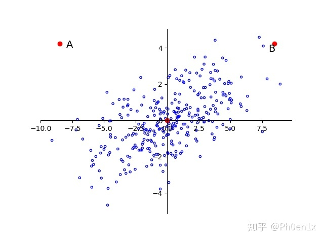
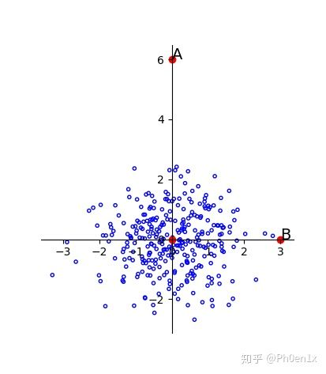

### 马氏距离

----

马氏距离适用于高维线性分布的数据中各维度间非独立同分布的情况。

标准化后的欧氏距离work的前提是数据各维度独立，如果各维度间不是独立，比如y=x，就算对x和y两个维度做了标准化，数据分布形状依然没有改变。所以需要将坐标轴旋转到数据主成分方向，让数据各维度之间相互独立，再做标准化。这就是马氏距离。

如图：数据大致呈y=x分布，就算对x，y两个维度做标准化，数据分布形状依然不变，A,B与原点距离依然相等。

如果将坐标轴方向旋转到数据主成分方向，然后再做各维度标准化，就可以很清楚的区分A，B相对于原点的距离，B更符合数据分布。

#### 参考：

[马氏距离(Mahalanobis Distance)](https://app.yinxiang.com/shard/s45/nl/27030704/58ea12bb-18ca-4bb7-b16b-88df33c8f395)

