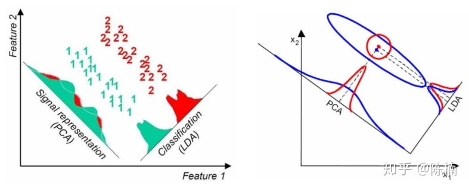

### LDA与PCA对比

LDA与PCA都可用于降维，因此有很多相同的地方，也有很多不同的地方

#### 相同点

- 两者均可用于数据降维
- 两者在降维时均使用了矩阵特征分解的思想
- 两者都假设数据符合高斯分布

#### 不同点

- LDA是有监督的降维方法，而PCA是无监督降维方法
- 当总共有K个类别时，LDA最多降到K-1维，而PCA没有这个限制
- LDA除了用于降维，还可以用于分类• LCA选择分类性能最好的投影方向，而PCA选择样本点投影具有最大方差的方向。这点可以从下图形象的看出，在某些数据分布下LDA比PCA降维较优（如下图的左图）。当然，某些数据分布下PCA比LDA降维较优（如下图的右图）。

### LDA算法小结

LDA算法既可以用来降维，也可以用来分来，但是目前来说，LDA主要用于降维，在进行与图像识别相关的数据分析时，LDA是一个有力的工具。下面总结一下LDA算法的优缺点。

#### LDA算法的优点

- 在降维过程中可以使用类别的先验知识经验，而像PCA这样的无监督学习无法使用先验知识；
- LDA在样本分类信息依赖均值而不是方差的时候，比PCA算法较优。

#### LDA算法的缺点
- LDA与PCA均不适合对非高斯分布样本进行降维
- LDA降维算法最多降到类别数K-1的维度，当降维的维度大于K-1时，则不能使用LDA。当然目前有一些改进的LDA算法可以绕过这个问题
- LDA在样本分类信息依赖方差而非均值的时候，降维效果不好
- LDA可能过度拟合数据

[线性判别分析LDA原理及推导过程（非常详细） - 知乎 (zhihu.com)](https://zhuanlan.zhihu.com/p/79696530)

