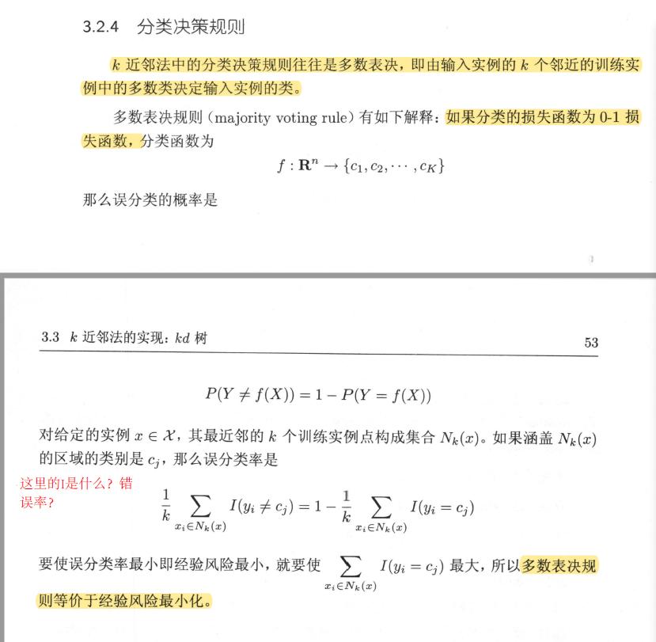

**多数表决规则（majority voting rule）等价于经验风险最小化**

----

证明：

如果分类的损失函数为0-1损失函数，分类函数为
$$
f: \mathbf{R}^{n} \rightarrow\left\{c_{1}, c_{2}, \cdots, c_{K}\right\}
$$

那么误分类的概率是
$$
P(Y \neq f(X))=1-P(Y=f(X))
$$

对于给定的实例

**参考**：

西瓜书

