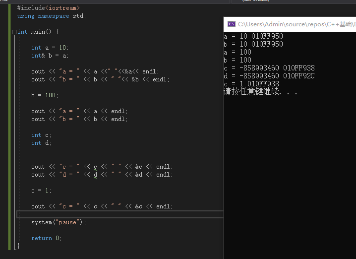

### python

在python中，= 即为引用。

```python
a=1
b=a
a is b #true
```


### C++

在C++中，由于变量需要先定义，在定义的时候就已经给变量分配了地址，=只是进行了赋值操作，不改变变量地址。

C++中引用操作需要`int& `操作。**`int&`操作必须初始化**，`int&b=a`，而不可以`int&b`。

**一旦初始化以后b就不可以改变了**。

```c++
a=10;
int&b = a;
int c=20;
b=c;
//输出：a=20 b=20 c=20
```

