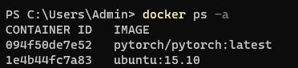

#### 基本操作

https://www.runoob.com/docker/docker-tutorial.html


#### 拷贝本地文件到docker容器

1. 查看所有容器，获取容器id

```dockerfile
$ docker ps -a
```





2. 拷贝本地文件到容器

```
docker cp <本地文件路径> <容器id>:<容器路径>
```

