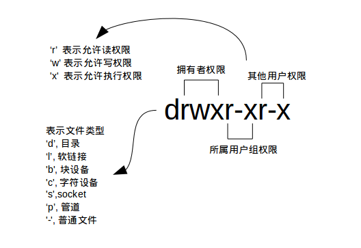

### 文件权限管理

#### 1. 查看文件权限

使用较长格式列出文件：

``` shell
ls -l
```


具体是什么意思呢：




> ls命令的其他用法：
>
> [Linux ls命令 | 菜鸟教程 (runoob.com)](https://www.runoob.com/linux/linux-comm-ls.html)


#### 2. 变更文件所有者

``` shell
sudo chown <user> <file>
```

> chown(change owner)
>
> [Linux chown 命令 | 菜鸟教程 (runoob.com)](https://www.runoob.com/linux/linux-comm-chown.html)


#### 3. 修改文件权限

修改文件权限有两种方式：

- 方式一：二进制数字表示

``` shell
chmod 600 iphone11
```

> 每个文件都有三组权限，分别对应拥有者、所属用户组、其他用户；文件读写执行对应的字母为rwx；用二进制表示就是111，转化为十进制就是7.
>
> 比如将iphone11文件权限改为`rw-------`，对应的十进制就是`600`。

- 方式二：加减赋值操作

``` shell
chmod go-rw iphone11
```

> g、o、u分别表示group、others、user， + 和 - 分别表示增加和去掉相应的权限。

