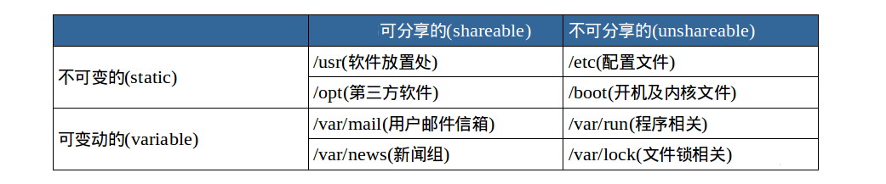

###  目录结构


``` shel
tree <想要展开的目录>
```


大部分目录结构是按照FHS标准规定的。

FHS依据文件系统使用的频繁与否以及是否允许用户随意改动，将目录定义为四种交互作用的形态：




### 目录路径

使用`cd`命令切换目录，`.`表示当前目录，`..`表示上级目录，`-`表示上一次所在的目录，`~`表示当前用户的home目录，使用`pwd`命令可以获取当前所在路径。

