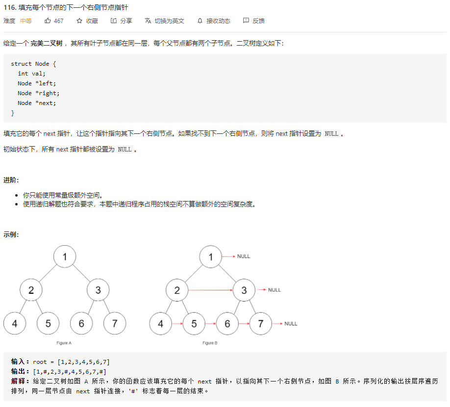
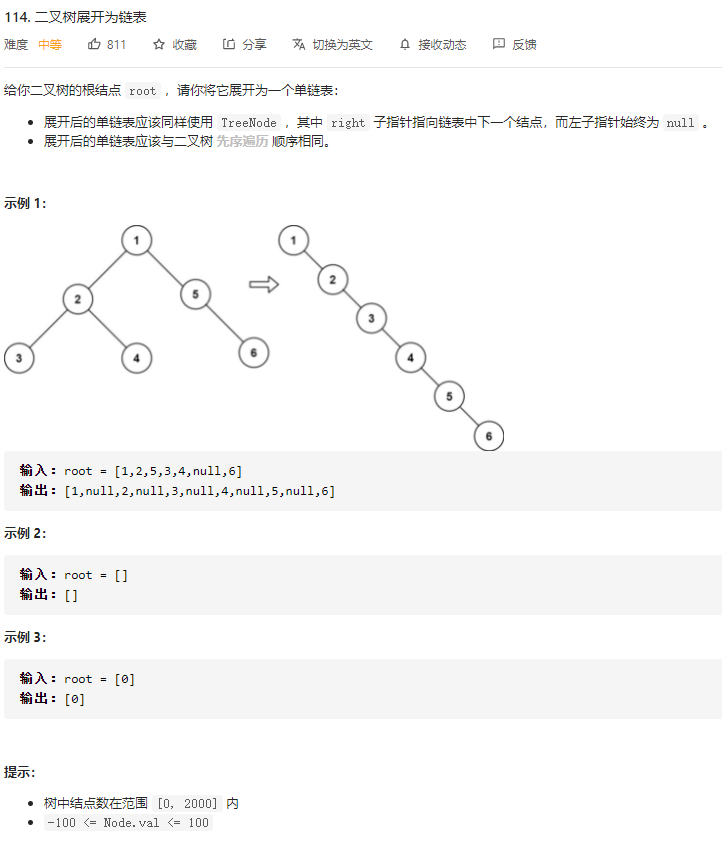

### 总结

----

**二叉树的算法题，都是基于递归框架，我们先要搞清楚root节点它自己要做什么，然后根据题目要求选择使用前序、中序、后序遍历的递归框架。**


二叉树相关的题目是最练习递归的基本功和框架思维的。

**快速排序就是个二叉树的前序遍历**

快排的逻辑：对于需要排序的`nums[a1...an]`,我们先找一个分界点p，通过交换元素使得`nums[a1...p-1]`都小于等于`nums[p]，nums[p+1,...,an]`都大于`nums[an]`，然后递归地对两个子数组重复上述行为，直到整个数组被排序。

这里分界点对应于二叉树的根节点，两个子数组对应根节点的左右子树。

**归并排序就是个二叉树的后序遍历**

先对左右子数组排序，然后合并。


在递归中强调过，写递归不要跳入递归中。


### 二叉树遍历框架

----

先序遍历

```python
def traverse(root):
    
    #遍历代码
    
    traverse(root.left)
    traverse(root.right)
```

中序遍历

```python
def traverse(root):
    traverse(root.left)
        
    #遍历代码
    
    traverse(root.right)
```
后序遍历

```python
def traverse(root):
    traverse(root.left)
    traverse(root.right)
         
    #遍历代码
    
```


### 翻转二叉树

----

```python
# class TreeNode:
#     def __init__(self, x):
#         self.val = x
#         self.left = None
#         self.right = None
#
# 代码中的类名、方法名、参数名已经指定，请勿修改，直接返回方法规定的值即可
#
# 
# @param pRoot TreeNode类 
# @return TreeNode类
#
class Solution:
    def Mirror(self , pRoot ):
        #边界值
        if pRoot is None:
            return None
        #函数功能
        temp = pRoot.left
        pRoot.left = pRoot.right
        pRoot.right = temp
        #递归使用函数功能
        #先序遍历框架
        self.Mirror(pRoot.left)
        self.Mirror(pRoot.right)
        
        return pRoot
```

----

### 填充二叉树节点的右侧指针

[116. 填充每个节点的下一个右侧节点指针 - 力扣（LeetCode） (leetcode-cn.com)](https://leetcode-cn.com/problems/populating-next-right-pointers-in-each-node/)



这题如果直接` root.left.next = root.right`的话，节点5和节点6就没法连接，所以需要一个辅助函数` connectNode(root1,root2)`，来实现节点5和节点6这种情况。

```python
"""
# Definition for a Node.
class Node:
    def __init__(self, val: int = 0, left: 'Node' = None, right: 'Node' = None, next: 'Node' = None):
        self.val = val
        self.left = left
        self.right = right
        self.next = next
"""

class Solution:
    def connect(self, root: 'Node') -> 'Node':
        if not root:
            return None
        root.next = None #这句不用，因为定义Node的时候默认next就是None
        self.connectNode(root.left, root.right)
        return root
    
    def connectNode(self, root1:'Node',root2:'Node'):
        if not root1 or not root2:
            return None
        
        root1.next = root2

        #先序遍历框架
        self.connectNode(root1.left, root1.right)
        self.connectNode(root2.left, root2.right)
        self.connectNode(root1.right, root2.left)

        return root1, root2
```


### 二叉树展开成链表

[114. 二叉树展开为链表 - 力扣（LeetCode） (leetcode-cn.com)](https://leetcode-cn.com/problems/flatten-binary-tree-to-linked-list/)



```python
# Definition for a binary tree node.
# class TreeNode:
#     def __init__(self, val=0, left=None, right=None):
#         self.val = val
#         self.left = left
#         self.right = right
class Solution:
    def flatten(self, root: TreeNode) -> None:
        """
        Do not return anything, modify root in-place instead.
        """
        if not root:
            return None
		
        #注意，先将左右子树拉平，而不能将这两行代码放到最后
        #后序遍历框架
        self.flatten(root.left)
        self.flatten(root.right)
        
        #备份右子树
        temp = root.right
        
		#左子树置空，右子树变为原来的左子树
        root.right = root.left
        root.left = None

        #将备份的右子树接上
        while root.right:
            root = root.right
        root.right = temp
```

