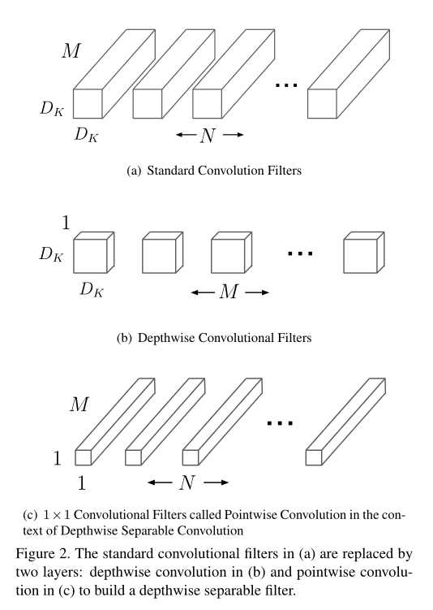
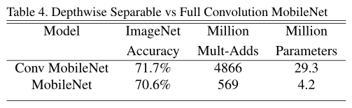
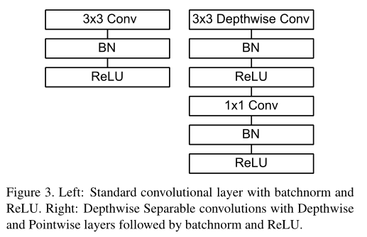
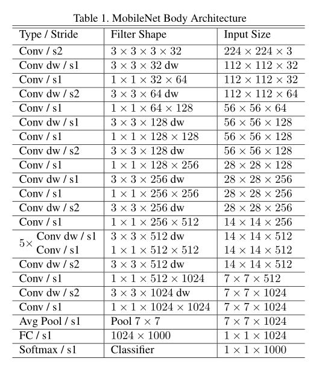
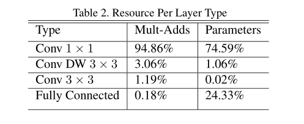
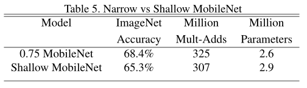
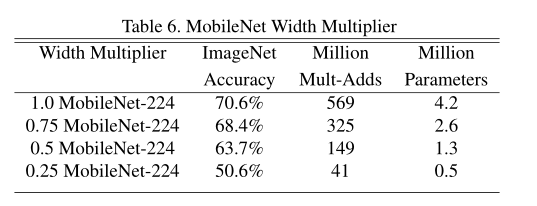
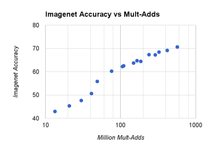
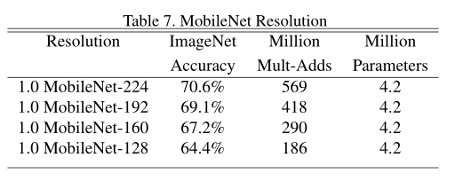
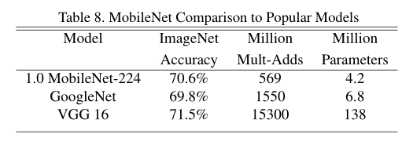

### 时间线

2017    MobileNet V1

2018    MobileNet V2

2019    MobileNet V3

# MobileNet V1

mobilenetV1由于实际提出时间比较早（2016.6），所以网络结构还是VGG那种直筒式的结构，主要不同就在于将VGG中的**标准卷积**换成了**深度可分离卷积**。并且探索了在空间和通道维度压缩计算量的可行性。

## 1. 深度可分离卷积（*depthwise separable convolution*）

深度可分离卷积就是将普通的卷积拆分为一个**深度卷积**和一个**逐点卷积**，将传统卷积核在通道维度上做的add操作摒弃，改为先对特征图每个通道单独做卷积，再用1x1x$C_{in}$的卷积核将这些单独的特征图做特征融合。

例如，对于一个12x12x3的特征图，

- 标准卷积核大小为3x3x3，卷积后得到12x12x1的特征图，在深度这个维度上采用的相加的策略。

- 深度卷积则采用3个3x3x1的卷积核，分别对特征图的每一个通道单独进行采样，得到3个12x12x1的特征图，然后将3个特征图按照原来通道的顺序进行叠加，得到12x12x3的特征图；然后用n个1x1x3的卷积核逐点卷积，得到12x12xn的特征图。

### 1.1 深度可分离卷积的优点

----

设输入特征图大小为$M\times N\times C_{in}$，卷积核大小为$K\times K \times C_{in}$，输出特征图大小为$M\times N\times C_{out}$。计算量计算乘加操作*(Mult-Adds)*。

#### 1.1.1 参数量

标准卷积核：$K^{2} \times C_{in} \times C_{out}$

深度可分离卷积：$(K^{2} +C_{out})\times C_{in} $

#### 1.1.2 计算量

标准卷积核：$K^{2}\times C_{in}\times M\times N\times C_{out}$

深度可分离卷积：$(K^{2}+C_{out})\times C_{in}\times M\times N$

- [x] tips：计算时，先计算单个卷积核的计算量$K^{2}\times C_{in}$，共滑动了$M_{out}N_{out}$次，再乘以卷积核的个数$C_{out}$，就得到计算量了。

#### 1.1.3 和传统卷积核对比

从参数量和计算量上可以很明显的看出，其实深度可分离卷积就是将标准卷积中$K^{2}$和$C_{out}$的操作**从乘变成了加**，在输出特征图一致的情况下，参数量和计算量都减小为原来的$1/{K^{2}}$。通常k=3，也就是说计算量能减小到原来的八分之一到九分之一。

### 1.2 为什么可以深度分离？

----

原文没有说，模型裁剪通常都是裁剪通道，在mobilenet V2里提到感兴趣的流形可以嵌入低维子空间，所以猜测通道维度其实是有冗余？

### 1.3 效果对比

----

Table 4展示了mobilenet和全卷积网络的性能对比，只低了1%的精度。

## 2. 网络结构

由于mobilenet V1提出比较早，所以结构上还是VGG式的直筒型。我们主要关注一下深度可分离模块即可。

可以看到mobilenet V1主要的耗时和参数都在$1\times 1$的卷积核上。

## 3. MobileNet瘦身

作者还给mobilenet加入了两个超参width multiplier和resolution multiplier，分别记为$\alpha$和$\beta$。

$\alpha$是按比例减少通道数，$\alpha \in (0,1]$。具体实现为$1\times 1$卷积核的数量乘上$\alpha$。

$\beta$是按比例减小特征图的大小，$\beta \in (0,1]$。具体实现为直接对原始图片resize。

计算量就变成了
$$
(K^{2}+\alpha C_{out})\times \alpha C_{in}\times \beta M\times \beta N
$$

### 3.1 实验结果

Table 5.展示了$\alpha=0.75$时，和相同参数/计算量的浅层网络的性能对比。可以看到裁剪通道比直接减少网络层效果更优。

Table 6.展示了在通道上不同裁剪力度下的精度损失情况。可以看到通道裁剪力度在0.5以上时，精度损失不严重，呈线性平缓下跌，但能极大减小计算量。裁剪力度在0.25时，精度会有有个突然下跌。

Table 7.展示了不同输入尺寸下的精度损失情况。resize尺度在0.5以上时，其实精度损失不是很严重。

- [x] 以上在通道和空间维度上的裁剪精度损失情况和具体网络通道数和图片尺寸有关，和任务数据也有关，实验结果可以作为通用任务的参考，但也不能一概而论。

## 4. 性能比较

如表8所示，性能上略低于VGG-16，略高于Googlenet，但是在计算量上有着绝对的优势。

## 5. 总结

核心贡献在于

- 提出了深度可分离卷积，能在较少的性能损失情况下，极大地降低模型计算复杂度。
- 探索了在通道维度上进行裁剪的可行性。

## 参考

[1] [MobileNets: Efficient Convolutional Neural Networks for Mobile Vision Applications](mobilenet_1704.04861.pdf)

[2] https://zhuanlan.zhihu.com/p/70703846

[3] https://zhuanlan.zhihu.com/p/31551004

[4] [官方实现](https://github.com/tensorflow/models/blob/master/research/slim/nets/mobilenet_v1.py)

