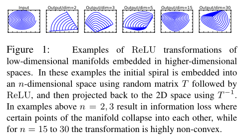

### 时间线

2017    MobileNet V1

2018    MobileNet V2

2019    MobileNet V3

# MobileNet V2

mobilenet V2相比于V1，改进了两方面的工作：

1. Linear Bottlenecks
2. Inverted residuals

## 1. Linear Bottlenecks

从流形学习的角度来讲，我们通常认为高维空间中我们感兴趣的流形（manifold of interest）可以嵌入到低维子空间。对于图像数据而言，从通道这个维度上看，我们感兴趣的流形也是可以嵌入低维空间的。

这一观点可以简单地通过减少特征图的通道数来实现，而且在mobilenet V1中也验证了这种想法的可行性。

但是，在低维空间中使用relu会丢失太多信息。简单计算一下，假设我们的数据是zero-centered的，在每个维度使用relu会完全丢失$1/2$的信息，在$R^{n}$中完全丢失的信息为$(1/2)^{n}$，维度越低，信息丢失越严重。

论文做了如下实验：

将一个二维流形通过一个随机矩阵 $T$ 嵌入到 $n$ 维流形后做 $relu$ 操作，然后通过 $T^{-1}$ 映射回二维流形。可以看到，当 $n=2,3$ 时，信息丢失严重，中心点坍塌；当 $n=15\space to\space 30$ 时，变换保持了高度的非线性。

所以，

## 2. Inverted residuals

## 3. 网络结构

## 4. 结果对比

## 参考

[1] MobileNetV2: Inverted Residuals and Linear Bottlenecks

[2] [轻量级CNN网络之MobileNetv2](https://zhuanlan.zhihu.com/p/52426865)

[3] [详解MobileNetV2](https://zhuanlan.zhihu.com/p/98874284)

[4] [轻量级神经网络“巡礼”（二）—— MobileNet，从V1到V3](https://zhuanlan.zhihu.com/p/70703846)

[5] [MobileNet V2 论文初读](https://zhuanlan.zhihu.com/p/33075914)

[6] [如何评价mobilenet v2 ?](https://www.zhihu.com/question/265709710)

[7] [官方实现](https://github.com/tensorflow/models/blob/master/research/slim/nets/mobilenet/mobilenet_v2.py)